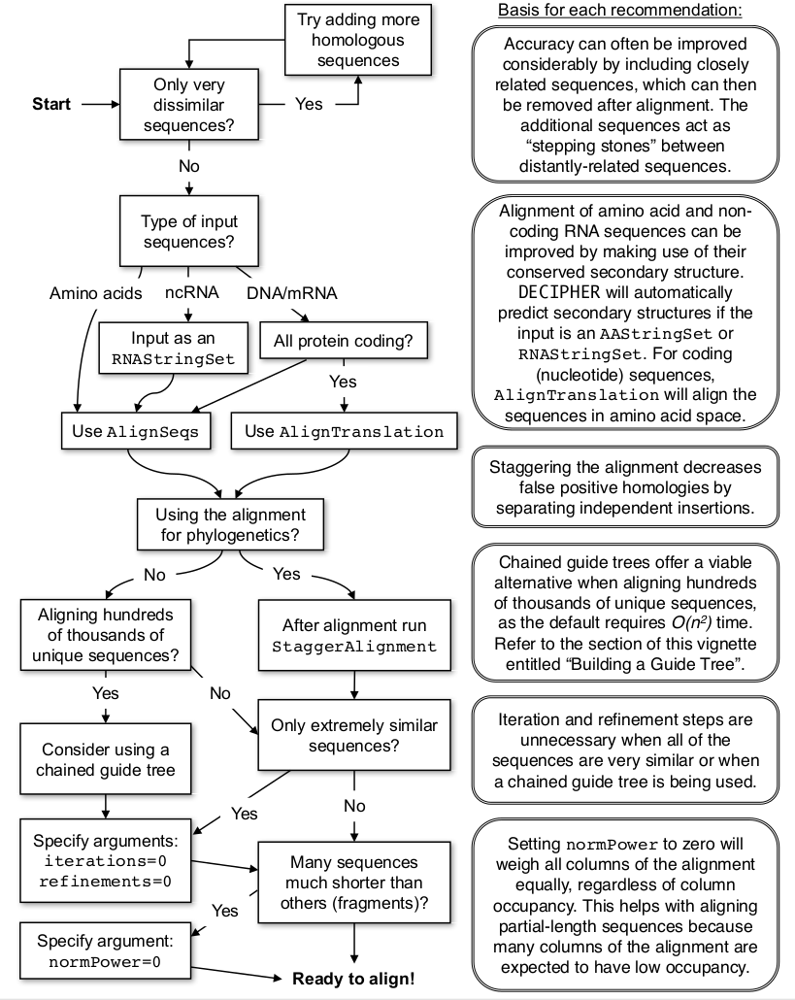

```{r setup, include=FALSE}
knitr::opts_chunk$set(echo = TRUE)
```

## Introducción
En la subcarpeta `data` tenemos dos archivos FASTA:

- `16S_ribosomal_RNA.fas`: 175 RNAs no codificantes.
- `50S_ribosomal_protein_L2.fas`: 317 secuencias codificantes.

Usaremos el paquete [DECIPHER](http://www2.decipher.codes/) [@Wright2016], que
puede instalarse desde Bioconductor de la manera siguiente, si todavía no está
instalado:

```{r instalar, eval=FALSE}
# Este bloque de código no se ejecuta automáticamente cada vez que convertimos
# el documento a HTML ("eval=FALSE").
if (!requireNamespace("BiocManager", quietly=TRUE))
    install.packages("BiocManager")
BiocManager::install("DECIPHER")
```

En la [página web de DECIPHER](http://www2.decipher.codes/index.html) 
podéis encontrar mucha documentación sobre cómo
usar el paquete. Entre toda esa documentación, os recomiendo la guía
[The Art of Multiple Sequence Alignment in R](http://www2.decipher.codes/Documentation/Documentation-ArtOfAlignment.html).
Reproduzco su figura 6 a continuación:



## Leer archivos FASTA en R

Primero, cargamos el paquete `DECIPHER`, que incluye otros paquetes, como
`Biostrings`. La función `readDNAStringSet()`, del paquete `Biostrings` es la
que nos permite leer un archivo FASTA y cargar en memoria todas las secuencias
de ese archivo:

```{r paquete}
# uso la función supressMessages para evitar la acumulación de mensajes en el
# archivo HTML final.
suppressMessages(library(DECIPHER))
```

El archivo con el que vamos a empezar es `data/50S_ribosomal_protein_L2.fas`.
Asumiendo que esto se ejecuta desde la misma carpeta de la práctica
(`T05_alineamientos`), esto debería funcionar:

```{r datos}
dna <- readDNAStringSet('data/50S_ribosomal_protein_L2.fas')
dna
```

### Ejercicio 1

Explora el contenido del objeto `dna`: de qué clase es, cuántas secuencias contiene...
Puedes usar la función `class()` para
averiguar qué clase de objeto es. La función `methods()` puede darte una lista
de lo que puedes hacer con un objeto de cierta clase. Por ejemplo: `methods(class = 'integer')`,
para saber qué *métodos* pueden aplicarse a un vector de enteros. Intenta encontrar la manera de
extraer una secuencia del objeto `dna` y obtener su reversa-complementaria.

## Alineamiento de nucleótidos

### Ejercicio 2
Usa la función `AlignSeqs()` para alinear las secuencias en el objeto `dna`. Puedes
usar `help(AlignSeqs)` para resolver dudas sobre su funcionamiento.

### Ejercicio 3
Usa la función `BrowseSeqs()` para visualizar el alineamiento. Verás que incluye
algunos *gaps*. ¿Cómo crees que se explicarían mejor estos *gaps*: como deleciones
en los ancestros de algunas secuencias, o como inserciones en los de otras?

### Ejercicio 4
Para guardar un archivo FASTA con las secuencias alineadas, usa la función
`writeXStringSet()`.

## Alineamiento en espacio de aminoácidos
La función `AlignTranslation()` nos permite alinear las traducciones de las secuencias,
en el espacio de aminoácidos. Esta función requiere un único argumento obligatorio,
que es el conjunto de secuencias de ADN o de ARN que se quiere traducir y alinear.
Además, el resultado del alineamiento de las traducciones, se puede presentar en
dos formatos: como alineamiento de aminoácidos, o bien como alineamiento *destraducido*
de nucleótios.

### Ejercicio 5
Utiliza `AlignTranslation()` y `BrowseSeqs()` para crear un alineamiento de codones (destraducido,
en espacio de nucleótidos) y compáralo con el alineamiento de las secuencias
nucleotídicas obtenido en el ejercicio 2. ¿Puedes encontrar diferencias?

### Ejercicio 6
Guarda también el alineamiento en espacio de aminoácidos en la sesión de trabajo,
por ejemplo bajo el nombre `AA_aligned`, y también en un archivo FASTA.

## Escalonamiento de alineamientos
A veces, dos se producen dos inserciones independientes en la misma región de un
gen, y por tanto no serían regiones homólogas. Tenemos la opción de *refinar* el
alineamiento buscando zonas de este tipo, en las que algunas secuencias tengan un
fragmento y otras tengan otro fragmento de origen diferente. La función
`StaggerAlignment()` busca y corrige estas falsas homologías mediante la apertura
de nuevos gaps.

### Ejercicio 7
Usa la función `StaggerAlignment()` para crear una nueva versión del alineamiento
de aminoácidos obtenido en el ejercicio 6, y compara los dos alineamientos.

## Alineamiento de genes no codificantes
El archivo `data/16S_ribosomal_RNA.fas` contiene secuencias de RNA no codificante
en formato FASTA. Para instruir a R que no es DNA, sino RNA (contiene uracilo),
usamos la función `readRNAStringSet()`.

### Ejercicio 8
Alinea las secuencias en `data/16S_ribosomal_RNA.fas` y guarda el resultado en un
archivo FASTA.


## Información de la sesión

Todo esto se ha ejecutado en el entorno siguiente:

```{R sessioninfo}
sessionInfo()
```

# Bibliography