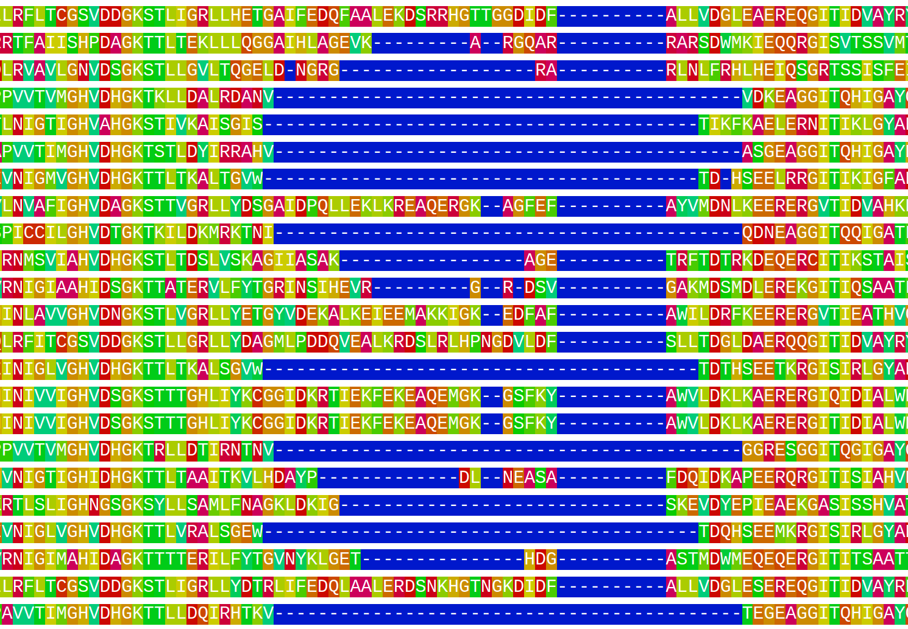
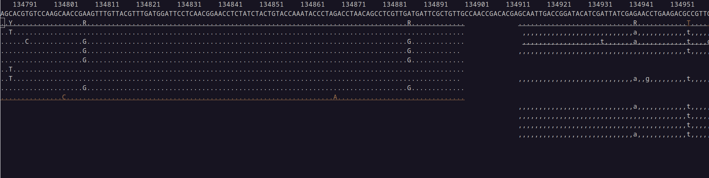

## Principales carpetas en Linux
```
/                    Direcotrio raíz.
├── dev              Archivos especiales de dispositivos.
├── etc              Configuración del sistema.
├── home             Carpetas de usuario.
├── media            Punto de montaje de medios extraíbles.
├── opt              Instalación manual de otros programas.
├── run              Datos variables del sistema
├── usr              Programas de usuario, aplicaciones...
│   ├── bin          Ejecutable
│   ├── lib          Librerías compartidas
│   ├── local        Programas instalados manualmente.
│   ├── sbin         Ejecutables de administración.
│   ├── share        Datos compartidos entre programas.
└── var              Registros que se actualizan (log files).
```

## Direcciones absolutas y relativas {.smaller}

`pwd` nos dice dónde estamos. Todos los comandos que usan archivos o carpetas
(e.g., `mkdir`, `cd`, `ls`...) entienden los caminos absolutos (desde el
directorio raíz) y los relativos.

### Direcciones relativas
- `../../usr/bin/needle`
- `bioinfo/results/2026-02-01`

### Direcciones absolutas
- `/home/usuario/Documentos/bioinfo/results/2026-02-01`
- `/usr/bin/needle`

## El PATH
La primera palabra en una orden debe ser el nombre de un archivo ejecutable.
Para no tener que dar la dirección completa cada vez, Bash recuerda en qué
carpetas suele haber archivos ejecutables y los busca allí, en el orden establecido.

```
echo $PATH
/usr/bin:/usr/local/bin:/opt/miniconda3/bin
```
Si instalamos ejecutables en una carpeta local, o bien la añadimos al PATH, o
bien los invocamos con la dirección completa.

## Cómo pedir ayuda
```
NAME
       man - an interface to the system reference manuals

SYNOPSIS
       man [man options] [[section] page ...] ...
       man -k [apropos options] regexp ...
       man -K [man options] [section] term ...
       man -f [whatis options] page ...
       man -l [man options] file ...
       man -w|-W [man options] page ...
```

# Alineamientos

## Alineamientos globales {.smaller}
<center>
](imatges/needleman_wunsch.png){width=400px}

Algoritmo de Needleman-Wunsch (programación dinámica).
Garantiza el alineamiento *óptimo*.
La puntución total es la suma de las puntuaciones de cada posición.
</center>

## Alineamientos globales {.smaller}
<center>
](imatges/needleman_wunsch.png){width=400px}

Tres alineamientos de puntuación óptima de 0:
```
                     GCATG-CU      GCA-TGCU      GCAT-GCU
                     G-ATTACA      G-ATTACA      G-ATTACA
```
</center>

## Esquemas de puntuación
- Simple:
  - Coincidencia: +1
  - *Mismatch*: -1
  - *indel*: -1
- Para favorecer alineamientos con pocos gaps más largos en lugar de muchos y cortos, se penaliza más la **aparición** que la **extensión** del *gap*.
- Matrices de similitud: puntúan cada cambio posible y definen lo que entendemos por un *buen* alineamiento.

## Matrices de similitud
```{r, results='asis'}
library(knitr)
library(kableExtra)
A <- data.frame(A=c(1,-1,-1,-1),
                G=c(-1,1,-1,-1),
                C=c(-1,-1,1,-1),
                T=c(-1,-1,-1,4))
row.names(A) <- c('A','G','C','T')
kable(A) %>% kable_styling(bootstrap_options = "basic",
                full_width = F)
```

Este esquema de puntuación valora más las coincidencias de timinas en el alineamiento.

## Matriz PAM
:::: {.columns}

:::{.column width="50%"}

:::{.fig-dayhoff}
<iframe width="400" height="400" src="https://www.whatisbiotechnology.org/assets/images/people/dayhoff/1000.jpg"></iframe>

<sub>By Ruth Dayhoff</sub>
:::

:::

:::{.column width="50%"}
Margaret Dayhoff introdujo las matrices PAM en 1978 para el alineamiento de proteínas.

Una matriz PAM$_n$ corresponde al tiempo suficiente para que *n* mutaciones hayan aparecido entre 100 aminoácidos.
:::

::::

## PAM250
```{r}
suppressMessages(library(pwalign))
data(PAM250)
PAM250
```

## BLOSUM (*block substitution matrix*)
```{r}
data(BLOSUM62)
BLOSUM62
```

B = {D, N}, J = {I, L}, Z = {E, Q}, X = {todos}, * = STOP

## BLOSUM vs PAM
Correspondencia aproximada entre matrices PAM y BLOSUM:

```{r}
M <- data.frame(PAM = c('PAM100','PAM120','PAM160','PAM200','PAM250'),
                BLOSUM = paste('BLOSUM', c('90','80','62','50','45'), sep=''))
kable(M) %>% 
  kable_styling(bootstrap_options = 'basic', full_width=TRUE)
```

## Alineamientos locales
:::: {.columns}

:::{.column width="50%"}
```{r}
#| fig-width: 5
#| fig-height: 5
seq1 <- c(1:200, 1:200, 401:1000)
seq2 <- c(1200:1001, 1000:801, 600:401, 101:400, 100:1)
plot(c(-100, 1200), c(-100, 1200), type = 'n', xlab = 'Secuencia 1', ylab = 'Secuencia 2', axes = FALSE)
points(seq1, seq2)
arrows(x0 = c(-100, 0), y0 = c(1200, -100), x1 = c(-100, 1000), y1 = c(0, -100), angle = 15, lwd = 3)
segments(x0 = c(-100, 201), y0 = c(800, -100), x1 = c(-100, 400), y1 = c(601, -100), col = 'red', lwd = 3)
```
:::

::: {.column width="50%"}
- La figura representa 5 alineamientos **locales** entre dos secuencias de ADN.
- Se observa una duplicación en la secuencia 2.
- Y una inversión (posible en nucleótidos).
- Hay también una región sin homología (en rojo).
:::

::::

## Algoritmo de Smith-Waterman
<center>
](imatges/smith-waterman.gif)
</center>

# Alineamientos múltiples

## 
<center>
{width=700px}

Ejemplo de alineamiento de múltiples secuencias, con una región dudosa.
</center>

## CLUSTAL
- Diferentes versiones: CLUSTAL (1988), CLUSTAL V (1992), CLUSTAL W (1994), CLUSTAL X (1997), CLUSTAL 2 (2007), CLUSTAL $\Omega$ (2011).
- **Alineamiento progresivo**: se empieza alineando las parejas de secuencias más semejantes.
- El **árbol guía** que determina el orden de incorporación de secuencias en el alineamiento se obtiene de una comparación inicial de todos los pares de secuencias.

http://www.clustal.org/

## MUSCLE {.smaller}
<center>
](imatges/muscle.png){width=600px}
</center>

## Otros programas
```{r}
M <- data.frame(Nombre = c('DECIPHER', 'MAFFT', 'T-Coffee'),
                Descripción = c('Alineamiento global, progresivo e iterativo en R',
                                'Alineamiento local y global, progresivo e iterativo',
                                'Alineamiento local y global, progresivo. Puede usar estructura 3D. Evalúa el alineamiento'),
                Licencia = c('GPL', 'BSD', 'GPL2'))
M %>% kable() %>% kable_styling(bootstrap_options='basic')
```

# Mapaje de lecturas cortas

## Datos

- Lecturas cortas (<300 bases) de un individuo, obtenidas con Illumina.
- Las lecturas pueden estar emparejadas.
- Contienen errores, normalmente < 1%.
- Archivos FASTQ con miles de secuencias.
- Problema: alinear cada lectura al genoma de referencia.

## Formato FASTQ
```
@SRR001666.1 071112_SLXA-EAS1_s_7:5:1:817:345 length=72
GGGTGATGGCCGCTGCCGATGGCGTCAAATCCCACCAAGTTACCCTTAACAACTTAAGGGTTTTCAAATAGA
+SRR001666.1 071112_SLXA-EAS1_s_7:5:1:817:345 length=72
IIIIIIIIIIIIIIIIIIIIIIIIIIIIII9IG9ICIIIIIIIIIIIIIIIIIIIIDIIIIIII>IIIIII/
@SRR001666.2 071112_SLXA-EAS1_s_7:5:1:801:338 length=72
GTTCAGGGATACGACGTTTGTATTTTAAGAATCTGAAGCAGAAGTCGATGATAATACGCGTCGTTTTATCAT
+SRR001666.2 071112_SLXA-EAS1_s_7:5:1:801:338 length=72
IIIIIIIIIIIIIIIIIIIIIIIIIIIIIIII6IBIIIIIIIIIIIIIIIIIIIIIIIGII>IIIII-I)8I
```

4 líneas por secuencia: `@`nombre, secuencia,`+`(nombre, opcional) y calidades. 

## Formato FASTQ. Calidades {.smaller}
```
  SSSSSSSSSSSSSSSSSSSSSSSSSSSSSSSSSSSSSSSSS.....................................................
  ..........................XXXXXXXXXXXXXXXXXXXXXXXXXXXXXXXXXXXXXXXXXXXXXX......................
  ...............................IIIIIIIIIIIIIIIIIIIIIIIIIIIIIIIIIIIIIIIII......................
  .................................JJJJJJJJJJJJJJJJJJJJJJJJJJJJJJJJJJJJJJJJ.....................
  LLLLLLLLLLLLLLLLLLLLLLLLLLLLLLLLLLLLLLLLLL....................................................
  PPPPPPPPPPPPPPPPPPPPPPPPPPPPPPPPPPPPPPPPPPPPPPPPPPPPPPPPPPPPPPPPPPPPPPPPPPPPPPPPPPPPPPPPPPPPPP
  !"#$%&'()*+,-./0123456789:;<=>?@ABCDEFGHIJKLMNOPQRSTUVWXYZ[\]^_`abcdefghijklmnopqrstuvwxyz{|}~
  |                         |    |        |                              |                     |
 33                        59   64       73                            104                   126
  0........................26...31.......40                                
                           -5....0........9.............................40 
                                 0........9.............................40 
                                    3.....9..............................41 
  0.2......................26...31........41                              
  0..................20........30........40........50..........................................93

 S - Sanger        Phred+33,  typically (0, 40)       J - Illumina 1.5+ Phred+64,  typically (3, 41)
 X - Solexa        Solexa+64, typically (-5, 40)      L - Illumina 1.8+ Phred+33,  typically (0, 41)
 I - Illumina 1.3+ Phred+64,  typically (0, 40)       P - PacBio        Phred+33,  typically (0, 93)
```

## Formato FASTQ. Nivel de calidad Phred.

$Q = -10 \cdot \log_{10}P$

$P = 10^{-\frac{Q}{10}}$

```{r phred}
P <- (1:10000)/10000
Q <- -10 * log10(P)
plot(P, Q, type='l', xlab='Probabilidad de error (P)', ylab='Nivel de calidad Phred (Q)')
abline(v=0.05, lty=2)
```

## Mapeo

```{r}
plot(c(0, 1), c(0.2, 1), type = 'n', axes = FALSE, xlab = '', ylab = '')
abline(h = 0.9, lwd = 5)
text(0, 0.95, 'Cromosoma de referencia', pos = 4)
segments(c(0.00, 0.09, 0.25, 0.55),
         c(0.80, 0.70, 0.60, 0.50),
         c(0.50, 0.51, 0.75, 1.00),
         c(0.80, 0.70, 0.60, 0.50),
         lty = 2, col = 'gray')
arrows(c(0.00, 0.09, 0.25, 0.50, 0.51, 0.55, 0.75, 1.00),
       c(0.80, 0.70, 0.60, 0.80, 0.70, 0.50, 0.60, 0.50),
       c(0.12, 0.20, 0.35, 0.40, 0.41, 0.65, 0.65, 0.90),
       c(0.80, 0.70, 0.60, 0.80, 0.70, 0.50, 0.60, 0.50),
       code = 2, lwd = 1.5, angle = 15,
       col = c('red', 'red', 'blue', 'blue', 'blue', 'blue', 'red', 'red'))
text(0.25, 0.3, 'Lecturas emparejadas y concordantes')
legend(0.7, 0.4, c('Forward', 'Reverse'), lty = 1, col = c('red', 'blue'), bty = 'n')
```
## Genotecas
- Los protocolos que incluyen PCR pueden introducir sesgos de cobertura.
- Si la fragmentación es aleatoria, no esperamos lecturas que mapeen exactamente
  en la misma posición (duplicaciones por PCR?).
- Los protocolos con fragmentación no aleatoria (digestión enzimática) no permiten
  identificar las duplicaciones por PCR.

## Ejemplo
{width=650px}

## Limitaciones de la estrategia
El uso de un genoma de referencia para descubrir variación genética entre
las muestras implica que:

1. La referencia puede contener errores.
2. Sólo podemos comparar la fracción común o mapeable.
3. Las muestras más parecidas a la referencia mapean mejor.

## ¿Cómo se guardan los resultados?
```
Coor      12345678901234  5678901234567890123456789012345
ref       AGCATGTTAGATAA**GATAGCTGTGCTAGTAGGCAGTCAGCGCCAT

+r001/1         TTAGATAAAGGATA*CTG
+r002          aaaAGATAA*GGATA
+r003        gcctaAGCTAA
+r004                      ATAGCT..............TCAGC
-r003                             ttagctTAGGC
-r001/2                                         CAGCGGCAT
```

Alineamiento de 6 lecturas cortas a un genoma de referencia.
r001/1 i r001/2: lecturas apareadas.
Minúsculas: extremos no alineados.

## Formato [SAM](http://samtools.github.io/hts-specs/SAMv1.pdf). Ejemplo {.smaller}
```
@HD VN:1.6 SO:coordinate
@SQ SN:ref LN:45
r001   99 ref  7 30 8M2I4M1D3M  = 37  39 TTAGATAAAGGATACTG *
r002    0 ref  9 30 3S6M1P1I4M  *  0   0 AAAAGATAAGGATA    *
r003    0 ref  9 30 5S6M        *  0   0 GCCTAAGCTAA       * SA:Z:ref,29,-,6H5M,17,0;
r004    0 ref 16 30 6M14N5M     *  0   0 ATAGCTTCAGC       *
r003 2064 ref 29 17 6H5M        *  0   0 TAGGC             * SA:Z:ref,9,+,5S6M,30,1;
r001  147 ref 37 30 9M          =  7 -39 CAGCGGCAT         * NM:i:1
```

## Formato SAM. Campos obligatorios {.smaller}
 Columna  Nombre   Tipo        Descripción
--------  ------   ----        -----------
1         QNAME    caracteres  Nombre de la secuencia corta
2         FLAG     número      Marcas binarias
3         RNAME    caracteres  Nombre de la secuencia de referencia
4         POS      número      Posición izquierda de mapeo (base 1)
5         MAPQ     número      Calidad de mapaje (escala Phred)
6         CIGAR    caracteres  Descripción de alineamiento codificada
7         RNEXT    caracteres  Referencia donde mapea la pareja (si hay)
8         PNEXT    número      Posición de la pareja (si hay)
9         TLEN     número      Longitud observada del fragmento
10        SEQ      caracteres  Secuencia del segmento
11        QUAL     caracteres  ASCII de calidades de bases (+33, en Phred)

## {.bigger}
<center>
**Hay 10 tipos**

**de personas:**

**las que entienden**

**binario y**

**las que no**
</center>

## Formato SAM. Marcas binarias {.smaller}

 Decimal       Binario      Descripción
--------  ------------      ------------
     1    000000000001      Lecturas emparejadas.
     2    000000000010      Alineamiento concordante.
     4    000000000100      Lectura no mapeada.
     8    000000001000      Pareja no mapeada.
    16    000000010000      SEQ invertida y complementada.
    32    000000100000      SEQ de pareja invertida-complementada.
    64    000001000000      Primera lectura de la pareja.
   128    000010000000      Última lectura de la pareja.
   256    000100000000      Alineamiento secundario.
   512    001000000000      No pasa los filtros de calidad.
