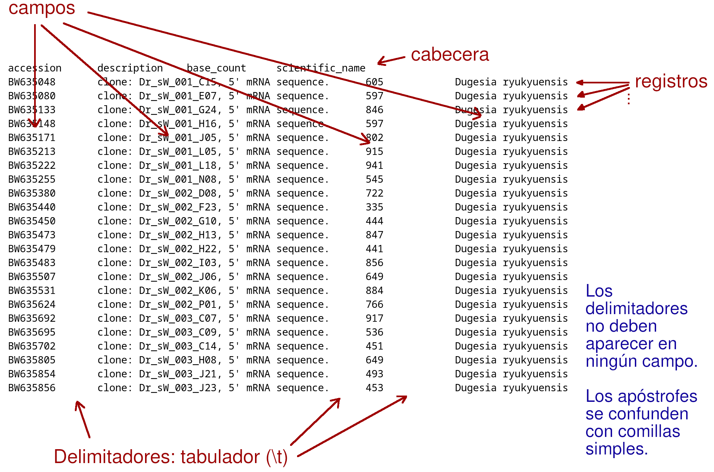
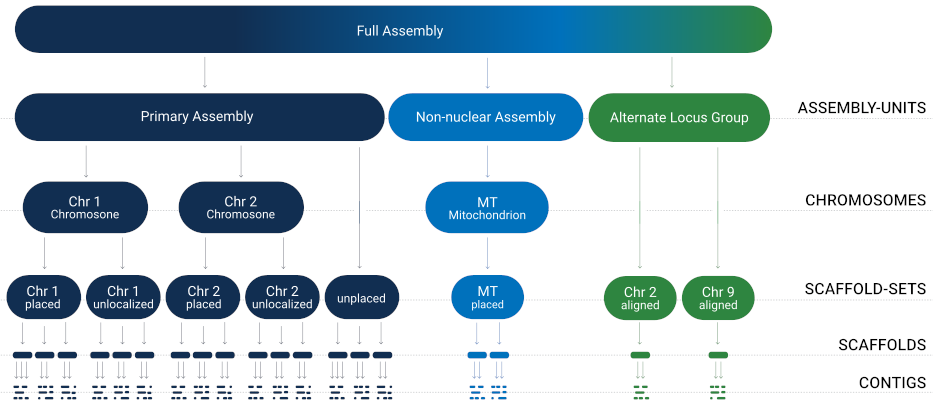

## Objetivos

- Por qué no usar hojas de cálculo.
- Marcos de datos ordenados.
- Otros formatos: JSON y YAML.

## Hojas de cálculo
Motivos para NO usarlas:

1. No separan datos de resultados.
2. Riesgo de modificar datos inadvertidamente.
3. Permiten datos desordenados.
4. Toman decisiones autónomas (tipo de datos).
5. Uso de formatos no estándar.

## Datos desordenados

1. Variables en filas y columnas.
2. Más de una variable por columna.
3. Columnas con valores de tipos diferentes.
4. Nombres de columnas que deberían ser valores.
5. Diferentes tipos de unidades observacionales por tabla.
6. Repetición de observaciones entre tablas.

## Ejemplo desordenado 1 {.smaller}

```{r}
#| echo: true

library(kableExtra)
untidy <- data.frame(
   paciente = c('A01', 'A01', 'A02', 'A02', 'A03', 'A03'),
   presion  = c(98, 52, 101, 58, 120, 80),
   tipo = rep(c('sistólica', 'diastólica'), 3)
)
kable(untidy, col.names = c('Paciente', 'Presión arterial', 'Tipo'))
```
 
*Tipo* no es una variable. La presión sistólica y la diastólica son dos
variables diferentes.

## Cómo arreglarlo

```{r}
#| echo: true
library(tidyr)
tidy <- pivot_wider(untidy, id_cols = 'paciente',
                    names_from = 'tipo',
                    values_from = 'presion')
kable(tidy)
```

## Ejemplo desordenado 2 {.smaller}

```{r}
#| echo: true
untidy <- data.frame(
   mouse  = c('A01', 'A02', 'A03', 'A04', 'A05', 'A06'),
   group  = c('maleYoung', 'maleYoung', 'maleOld', 'femaleYoung', 'femaleYoung', 'femaleOld'),
   dosis  = c(0.05, 0.10, 0.05, 0.05, 0.10, 0.05),
   effect = c(-0.78, -1.20, 0.02, 0.83, 1.51, 0.53)
)
kable(untidy)
```

*group* codifica dos variables: sexo y edad.

## Cómo arreglarlo

```{r}
#| echo: true
tidy <- untidy[, -2]
tidy$sex <- factor('male', levels = c('male', 'female'))
tidy[startsWith(untidy$group, 'female'), 'sex'] <- 'female'
tidy$age <- factor('old', levels = c('young', 'old'))
tidy[endsWith(untidy$group, 'Young'), 'age'] <- 'young'
```

```{r}
kable(tidy) %>% scroll_box(width = '800px', height = '400px')
```

## Ejemplo desordenado 3 {.smaller}

```{r}
#| echo: true
untidy <- data.frame(
   country = c('Albania', 'Namibia', 'Cuba'),
   GDP2021 = c(16127,  9709, 15201),
   GDP2022 = c(17112,  9953, 15558),
   GDP2023 = c(17991, 10138, 15313),
   GDP2024 = c(18920, 10281, 15144),
   GDP2025 = c(20362, 10740, 15296)
)
kable(untidy)
```

Los nombres de algunas columnas son (o contienen) valores de una variable.

## Cómo arreglarlo

```{r}
#| echo: true
tidy <- pivot_longer(untidy,
                     cols = 2:6,
                     names_to = 'year',
                     names_prefix = 'GDP',
                     values_to = 'GDP')

kable(tidy) %>% scroll_box(height = '300px', width = '500px')
```

## Ejemplo desordenado 4 {.smaller}

```{r}
#| echo: true
untidy <- data.frame(
   Tissue = c('cerebellum', 'cerebellum', 'cerebellum', 'lung', 'lung', 'lung'),
   Gene   = c('HBA1', 'OVGP1', 'TMEM181', 'HBA1', 'OVGP1', 'TMEM181'),
   Function = rep(c('oxygen transport', 'chitinase activity', 'toxic substance binding'), 2),
   Expression = c(3, 25, 12, 28, 9, 40)
)
```

```{r}
kable(untidy)
```

Hay dos tipos diferentes de unidades de observación en la misma tabla.

## Cómo arreglarlo {.smaller}

```{r}
#| echo: true
geneExp <- untidy[, -3]
geneFun <- unique(untidy[, c('Gene', 'Function')])
```

:::: {.columns}

::: {.column width="50%"}
```{r}
kable(geneExp)
```
:::

::: {.column width="50%"}
```{r}
kable(geneFun)
```
:::

::::

## Ejemplo desordenado 5 {.smaller}
```{r}
untidy1 <- data.frame(
   gene  = c('HBA1', 'OVGP1', 'TMEM181', 'SFTPC'),
   chr   = c(16, 1, 6, 8),
   first = c(176680, 111414319, 158536436, 22156913),
   last  = c(177522, 111427735, 158635435, 22164479)
)
untidy2 <- data.frame(
   gene  = c('OVGP1', 'HBA1', 'SFTPC', 'TMEM181'),
   chr   = c(1, 16, 8, 6),
   Func  = c('chitinase activity', 'oxygen transport',
             'respiratory gaseous exchange', 'toxic substance binding')
)
```

:::: {.columns}
::: {.column width="50%"}
```{r}
kable(untidy1, caption = 'untidy1')
```
:::
::: {.column width="50%"}

:::
::::

:::: {.columns}
::: {.column width="50%"}
Información de las mismas unidades observacionales repetida en más
de una tabla.
:::
::: {.column width="50%"}
```{r}
kable(untidy2, caption = 'untidy2')
```
:::
::::

## Cómo arreglarlo
```{r}
#| echo: true
tidy <- untidy1
tidy$Func <- untidy2[match(untidy1$gene, untidy2$gene), 'Func']
```

```{r}
kable(tidy)
```

## `match()` {.smaller}
### Descripción
Devuelve un vector de las posiciones de las (primeras) coincidencias de su primer
argumento en su segundo argumento.

`match(x, table, nomatch = NA_integer_, incomparables = NULL)`

### Argumentos

- `x`, vector de valores para ser buscados.
- `table`, vector de valores entre los que se buscan los de `x`. 
- `nomatch`, valor a devolver en caso de no encontrarse un elemento de `x` en `table`.
- `incomparables`, vector de valores que se quiere buscar.
 
## `pivot_longer()` {.smaller}
### Descripción
Alarga un marco de datos cuando los nombres de varias columnas son en realidad
*valores* de una o más variables adicionales. Uso básico:

`pivot_longer(data, cols, names_to, values_to)`

### Argumentos básicos
- `data`, marco de datos que queremos alargar.
- `cols`, selección de columnas a consolidar en un par de nuevas variables.
- `names_to`, nombre de la nueva variable que contendrá los nombres de las columnas.
- `values_to`, nombre de la nueva variable que contendrá los valores de las columnas.

## Datos ordenados

1. Cada columna es una variable, y cada variable, en una columna.
2. Cada fila es una observación, y cada observación, en **una** fila.
3. Cada celda contiene un valor, y cada valor, en una única celda.

## Modelo de datos

- ¿De qué entidades queremos guardar datos?
- ¿Cómo las representamos?
- ¿Qué datos queremos guardar y para qué?
- ¿Cómo se relacionan entre ellos?

## Modelo de tabla (*flatfile*)
{width=700px}

## Modelo de tabla (*flatfile*)
- No contiene **metadatos** (más que la cabedera).
- No hay relaciones entre los registros, ni entre los campos.
- No hay *índices* o maneras automáticas de encontrar un registro.
- No tienen sistemas de compresión propios.
- Son legibles para humanos y fácilmente portables.

## Modelo de árbol 


[<sub>Modelo de datos de ensamblajes genómicos del NCBI</sub>](https://www.ncbi.xyz/datasets/docs/v2/data-processing/policies-annotation/data-model/)

## Formato [JSON](https://www.json.org/json-en.html) {.smaller}
:::: {.columns}
::: {.column width="70%"}
```
{
    "count": 3,
    "next": null,
    "previous": null,
    "results": [
        {
            "metadata": {
                "accession": "PF00001",
                "name": "7 transmembrane receptor (rhodopsin family)",
                "source_database": "pfam",
                "type": "domain",
                "integrated": "IPR000276",
                "member_databases": null,
                "go_terms": null
            },
            "proteins": [
                {
                    "accession": "a0a087r9w5",
                    "protein_length": 755,
                    "source_database": "unreviewed",
                    "organism": "9233",
                    "in_alphafold": true,
                    "in_bfvd": false,
                    "entry_protein_locations": [
                        {
                            "fragments": [
                                {
                                    "start": 419,
                                    "end": 678,
                                    "dc-status": "CONTINUOUS"
                                }
                            ],
                            "representative": false,
                            "model": "PF00001",
                            "score": 1.4e-23
                        }
                    ]
                }
            ]
        },
        {
            "metadata": {
                "accession": "PF00057",
                "name": "Low-density lipoprotein receptor domain class A",
                "source_database": "pfam",
                "type": "repeat",
                "integrated": "IPR002172",
                "member_databases": null,
                "go_terms": null
            },
            "proteins": [
                {
                    "accession": "a0a087r9w5",
                    "protein_length": 755,
                    "source_database": "unreviewed",
                    "organism": "9233",
                    "in_alphafold": true,
                    "in_bfvd": false,
                    "entry_protein_locations": [
                        {
                            "fragments": [
                                {
                                    "start": 21,
                                    "end": 57,
                                    "dc-status": "CONTINUOUS"
                                }
                            ],
                            "representative": false,
                            "model": "PF00057",
                            "score": 0.002
                        }
                    ]
                }
            ]
        },
        {
            "metadata": {
                "accession": "PF13855",
                "name": "Leucine rich repeat",
                "source_database": "pfam",
                "type": "repeat",
                "integrated": "IPR001611",
                "member_databases": null,
                "go_terms": null
            },
            "proteins": [
                {
                    "accession": "a0a087r9w5",
                    "protein_length": 755,
                    "source_database": "unreviewed",
                    "organism": "9233",
                    "in_alphafold": true,
                    "in_bfvd": false,
                    "entry_protein_locations": [
                        {
                            "fragments": [
                                {
                                    "start": 124,
                                    "end": 183,
                                    "dc-status": "CONTINUOUS"
                                }
                            ],
                            "representative": false,
                            "model": "PF13855",
                            "score": 6.5e-10
                        },
                        {
                            "fragments": [
                                {
                                    "start": 244,
                                    "end": 304,
                                    "dc-status": "CONTINUOUS"
                                }
                            ],
                            "representative": false,
                            "model": "PF13855",
                            "score": 9.2e-10
                        }
                    ]
                }
            ]
        }
    ]
}
```
:::
::: {.column width="30%"}
Permite incorporar metadatos. Pares nombre-valor organizados jerárquicamente.
:::
::::

## Formato YAML
```
title: "Bases de datos"
format:
   revealjs:
      embed-resources: true
      scrollable: true
```

Usado bastante en archivos de configuración. Pares nombre-valor con estructura
jerárquica.

