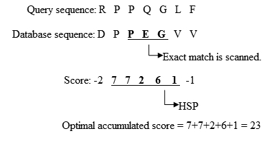
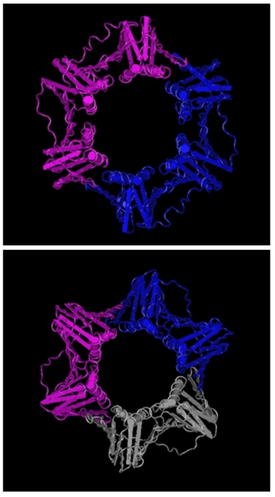

## Alineamientos locales

1. Pares de segmentos con puntuación máxima.
2. La puntuación *S* de un alineamiento depende de:
   - La matriz de puntuación.
   - El esquema de puntuación de los *gaps*
3. ¿Cuál es la distribución de *S* en pares aleatorios de secuencias?

## ¿Qué significa *aleatorias*?

1. Pares de secuencias reales pero no homólogas.
2. Permutaciones de los residuos de secuencias reales.
3. Simulación de secuencias a partir de un modelo.

Entonces, ¿Cuál es la distribución de *S*?

## 
1. Si sólo usamos alineamientos **sin** *gaps*.
2. Si la puntuación esperada al azar es negativa.

Se puede demostrar [@Karlin1990] que:

$$
P(S < x) = e^{-Kmne^{-\lambda x}}
$$

- *S*: puntuación del **mejor** alineamiento local entre dos secuencias.
- *m* y *n*: longitudes de las secuencias.
- *K* y $\lambda$: parámetros que dependen de la composición de las secuencias y del sistema de puntuación.

## 

```{r}
library(MetBrewer)
pal <- met.brewer('Egypt', 4)
m <- 500
n <- 500
lam <- c(0.318, 0.232, 0.229, 1.28)
K <- c(0.13,  0.11,  0.09,  0.62)
#lam <- c(0.267, 0.239, 0.198, 0.294, 1.28, 0.62)
#K <- c(0.041, 0.027, 0.017, 0.110, 0.62, 0.41)
x <- 1:70
plot(range(x), c(0, 1), type = 'n', axes = FALSE, xlab = 'x', ylab = 'P(S < x)',
     main = 'Función de distribución acumulada (m = n = 500)')
lines(x, exp(-K[1]*m*n*exp(-lam[1]*x)), col = pal[1], lwd = 2)
lines(x, exp(-K[2]*m*n*exp(-lam[2]*x)), col = pal[2], lwd = 2)
lines(x, exp(-K[3]*m*n*exp(-lam[3]*x)), col = pal[3], lwd = 2)
lines(x, exp(-K[4]*m*n*exp(-lam[4]*x)), col = pal[4], lwd = 2)
#lines(x, exp(-K[5]*m*n*exp(-lam[5]*x)), col = pal[5], lwd = 2)
#lines(x, exp(-K[6]*m*n*exp(-lam[6]*x)), col = pal[6], lwd = 2)
legend(45, 0.5, c(expression(paste('BLOSUM62, ',    lambda, " = 0.318, K = 0.13")),
                  expression(paste('BLOSUM50, ',    lambda, " = 0.232, K = 0.11")),
                  expression(paste('PAM250, ',      lambda, " = 0.229, K = 0.09")),
                  expression(paste('DNA (+1/-2), ', lambda, " = 1.28,  K = 0.62"))),
       lwd = 2, col = pal, bty = 'n', cex = 0.8)
axis(1)
axis(2)
```

Los alineamientos de ADN obtienen puntuaciones menores. Cuanto mayor es la
divergencia admitida por la matriz de puntuación, mayor es la puntuación esperada.

## Valor *E*
Número esperado de alineamientos con una puntuación de al menos *S*:

$$
E = Kmne^{-\lambda S}
$$
Cuanto **menor** es *E*, más significativo es el alineamiento.

## *Bitscore*
Es una normalización de la puntuación *S*, que ya no depende del esquema de
puntuación, y tiene las mismas unidades en todas las búsquedas:

$$
S' = \frac{\lambda S - \log K}{\log 2}
$$

$$
E = mn2^{-S'}
$$

## Valor *p*
Probabilidad de observar una puntuación mayor o igual a *S* por casualidad:

$$
p = 1 - e^{-E}
$$

Se deriva del hecho de que el número de alineamientos aleatorios con puntuación
mayor o igual a *S* sigue una distribución de Poisson.

## Cómo funciona
1. Detecta e ignora regiones repetitivas o de *baja complejidad* de la *query*.
2. Hace una lista de palabras de *k* letras de la *query* (*k* = 11 para DNA):

    ```
                          PQGEFG
                          PQG
                           QGE
                            GEF
                             EFG
    ```
3. Añade a la lista palabras *vecinas* que alinearían con puntuación de al menos *T*.

## Cómo funciona
4\. Busca las palabras de la lista entre las secuencias de la base de datos (indexadas).

5\. Alarga la *semilla* de los alineamientos encontrados (*High-scoring Segment Pair*, HSP).

   <div class="centered">
   
   </div>

## Cómo funciona
6\. Enumera HSPs con puntuación mayor de la que se produciría por azar.

7\. Evalúa la significación de los HSPs.

8\. Combina dos o más HSP en uno.

9\. Muestra el alineamiento local Smith-Waterman de cada resultado.

10\. Enumera los resultados con valor *E* menor o igual a un cierto umbral.

## Principales programas
```{r}
library('kableExtra')
M <- data.frame(Programa = c('blastn','blastp','blastx','tblastn','tblastx'),
                Query = c('DNA','proteína','DNA','proteína','DNA'),
                'Base de datos' = c('DNA','proteína','proteína','DNA','DNA'))
kable(M) %>% kable_styling(bootstrap_options = 'basic')
```

## PSI-BLAST {.smaller}

::::{.columns}
:::{.column width="40%"}

```{r}
library(knitr)
library(kableExtra)
seq <- c('GAGGTAAAC',
         'TCCGTAAGT',
         'CAGGTTGGA',
         'ACAGTCAGT',
         'TAGGTCATT',
         'TAGGTACTG',
         'ATGGTAACT',
         'CAGGTATAC',
         'TGTGTGAGT',
         'AAGGTAAGT')
kable(seq, col.names = NULL) %>% kable_styling(html_font = 'courier')
```
:::

:::{.column width="60%"}
### PSSM

```{r}
m <- matrix(unlist(lapply(seq, function(x) strsplit(x, ''))),
            nrow = 10, byrow = TRUE)
# position frequency matrix
pfm <- apply(m, 2, function(x) table(factor(x, levels = c('A','C','G','T'), ordered = TRUE)))

# position probability matrix (with pseudocounts)
ppm <- (pfm + 0.1) / 10.4

background <- matrix(rep(1/4, 36), nrow = 4)
PSSM <- log(ppm / background, base = 2)

kable(round(PSSM, digits = 2), col.names = NULL) %>%
  kable_styling(font_size = 18)
```

Ejemplo de *Position Specific Scoring Matrix*
:::
::::

## PSI-BLAST {.flexbox .vcenter}

{width=500px}

El PSI-BLAST empieza como un BLASTP (1). A partir del alineamiento de las
secuencias homólogas que superan el umbral de valor E, genera una PSSM (2).
Y utiliza la PSSM como nueva consulta (query) para añadir secuencias homólogas
al alineamiento y repetir el ciclo.

## [PSI-BLAST](https://www.ebi.ac.uk/Tools/sss/psiblast/)

<div style="float: left; width: 40%;">
{width=200px}
</div>

<div style="float: right; width: 60%;">
El PSI-BLAST es capaz de detectar la homología entre las secuencias de la
subunidad $\beta$ de la DNA polimerasa III de *E. coli* (arriba, número de
acceso NP_002583) y la
proteína humana PCNA (abajo, NP_002583), de estructura y función similares, pero muy divergente
en la secuencia aminoacídica.
</div>

## BLAST en la web

### [NCBI BLAST](https://blast.ncbi.nlm.nih.gov/Blast.cgi)

### [EMBL-EBI BLAST](https://www.ebi.ac.uk/Tools/sss/ncbiblast/)

Existe tamién un paquete de programas `blast` para línea de comandos que
utilizaremos en prácticas.

## Referencias