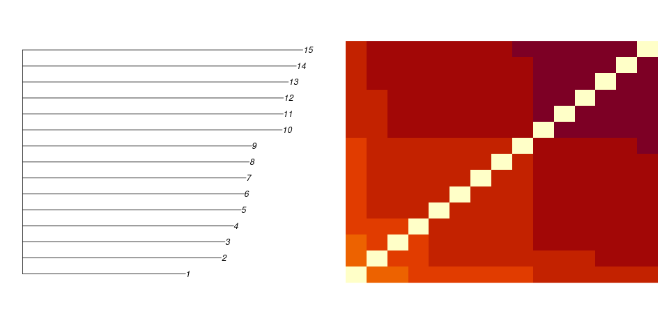
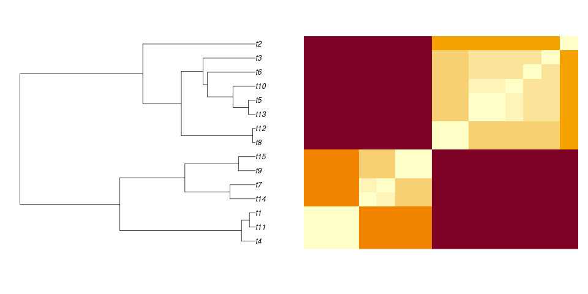

# Los datos
## Distancias
Si comparamos 15 organismos entre ellos, podemos obtener
una matriz de diferencias o **distancias** entre ellos,
independientemente de las características que comparemos.

## Dos tipos de matrices

```{r}
#| echo: false
#| message: false
#| warning: false
#| fig-width: 10
#| fig-height: 5
library('phytools')
if (! dir.exists('heatmaps')) dir.create('heatmaps')
if (! file.exists('heatmaps/startree25.png')) {
   for (i in 1:25) {
      t1 <- rcoal(15)
      t2 <- starTree(1:15, sort(rnorm(15, 1, 0.2)))
      name1 <- sprintf('heatmaps/cophenetic%02i.png', i)
      png(name1, width = 960, height = 480)
      par(mfrow = c(1, 2))
      image(cophenetic(t1), axes=FALSE)
      image(cophenetic(t2), axes=FALSE)
      dev.off()
      name2 <- sprintf('heatmaps/coaltree%02i.png', i)
      name3 <- sprintf('heatmaps/startree%02i.png', i)
      png(name2, width = 960, height = 480)
      par(mfrow = c(1, 2), mar = c(5.1, 1.1, 4.1, 1.1))
      plot(t1)
      image(cophenetic(t1), axes = FALSE)
      dev.off()
      png(name3, width = 960, height = 480)
      par(mfrow = c(1, 2), mar = c(5.1, 1.1, 4.1, 1.1))
      plot(t2)
      image(cophenetic(t2), axes = FALSE)
      dev.off()
   }
}
```

```{bash}
if [ ! -e imatges/cophenetic.gif ]; then
   convert -delay 200 -loop 0 heatmaps/cophenetic*.png imatges/cophenetic.gif
fi
if [ ! -e imatges/coaltree.gif ]; then
   convert -delay 200 -loop 0 heatmaps/coaltree*.png imatges/coaltree.gif
fi
if [ ! -e imatges/startree.gif ]; then
   convert -delay 200 -loop 0 heatmaps/startree*.png imatges/startree.gif
fi
```


## 
En la naturaleza, las diferencias entre organismos se distribuyen
más como en las matrices de la izquierda que como en las de la
derecha. Darwin se dio cuenta de que esto no tenía por qué ser
así.

## Distancias
### Orígenes independientes



## Distancias
### Origen común



## Algunas conclusiones
1. Lo que observamos son diferencias.
2. La estructura de las matrices de diferencias sugieren un
   modelo.
3. El modelo o hipótesis es una genealogía o árbol filogenético.
4. No todas las matrices se ajustan igual de bien a ese modelo.

## Alineamiento
```{r}
#| message: false
#| echo: false
library('phangorn')
t <- rphylo(20, 5, 0)
s <- simSeq(t, l = 50, type = 'DNA', rate = 0.5)
names(s) <- NULL
toupper(apply(as.character(s), 1, paste0, collapse = ''))
```

## Alineamientos
1. Semejanza suficiente para reconocer homología.
2. No todas las posiciones són igual de variables.
3. Las diferencias se **saturan**.
4. Se asume que cada posición evoluciona independientemente.

# El modelo

## Los árboles
```{r}
set.seed(14)
par(mfrow = c(1, 3), mar = c(2, 1, 5, 1))
t1 <- rphylo(15, 2, 0)
z <- plot(t1, show.tip.label = FALSE, main = 'Ultramétrico')
axisPhylo()
points(0, 5.5, pch = 16)
text(0, 5.5, pos = 4, 'Raíz')
t2 <- rtree(15)
plot(t2, type = 'phylogram', y.lim = c(0, 15),
     show.tip.label = FALSE, main = 'No ultramétrico')
add.scale.bar(1.5, 0)
plot(t2, type = 'unrooted',
     show.tip.label = FALSE, main = 'No enraizado')
add.scale.bar(2, 0)
```

## Los árboles
1. La *topología* del árbol que relaciona las secuencias es un
   *parámetro* del modelo.
2. Las longitudes de las ramas también son parámetros a estimar.
3. ¿Cómo evolucionan las secuencias a lo largo del árbol? Modelo
   de evolución molecular.

## Cadena de Markov {.smaller}
::::{.columns}
:::{.column width="40%"}
```{r}
#| engine: 'tikz'
#| echo: false
\begin{tikzpicture}[node distance=3cm, auto, >=stealth, bend angle=20]
  % Estil dels nodes (els cercles amb les lletres)
  \tikzstyle{nuc} = [circle, draw, thick, fill=blue!10, minimum size=1cm, font=\sffamily\Large\bfseries]

  % Definició dels nodes
  \node[nuc] (A) {A};
  \node[nuc] (G) [right of=A] {G};
  \node[nuc] (C) [below of=A] {C};
  \node[nuc] (T) [below of=G] {T};

  % Definició de les transicions (fletxes)
  \path[->, thick]
    (A) edge [bend left] node {} (G)
    (G) edge [bend left] node {} (A)
    (C) edge [bend left] node {} (T)
    (T) edge [bend left] node {} (C)
    (A) edge [bend left] node {} (C)
    (C) edge [bend left] node {} (A)
    (G) edge [bend left] node {} (T)
    (T) edge [bend left] node {} (G)
    (A) edge [bend left] node {} (T)
    (T) edge [bend left] node {} (A)
    (C) edge [bend left] node {} (G)
    (G) edge [bend left] node {} (C);
\end{tikzpicture}
```
:::

:::{.column width="60%"}
### Matriz de transición

$$
P(t) = {\begin{pmatrix}
   p_{AA}(t) & p_{AG}(t) & p_{AC}(t) & p_{AT}(t) \\
   p_{GA}(t) & p_{GG}(t) & p_{GC}(t) & p_{GT}(t) \\
   p_{CA}(t) & p_{CG}(t) & p_{CC}(t) & p_{CT}(t) \\
   p_{TA}(t) & p_{TG}(t) & p_{TC}(t) & p_{TT}(t)
   \end{pmatrix} }
$$

Probabilidades de pasar de una base a otra en un tiempo *t*.
:::
::::

## Cadenas de Markov
Una cadena de Markov es una sucesión estocástica entre un número
finito de estados, de manera que las probabilidades de transición
sólo dependen del estado inmediatamente anterior.

Los modelos de evolución molecular usan *tiempo continuo*.
$p_{ij}(t)$ es la probabilidad de que el resíduo *i* se convierta
en *j* al cabo de un tiempo *t*, teniendo en cuenta *todos* los
caminos posibles o mutaciones intermedias.

## Tasas de cambio
Después de un pequeño intervalo de tiempo $\Delta t$, la probabilidad de
encontrar una adenina (A) en una posición de la secuencia será:

$$
p_A(t + \Delta t) = p_A(t) - p_A(t)\mu_A \Delta t + \sum_{x\neq A}p_x(t)\mu_{xA}\Delta t
$$
donde $\mu_A$ es la tasa a la que A se convierte en cualquier otra base,
y $\mu_{xA}$ son las tasas a las que C, G y T se convierten en A.

## Matriz de tasas

$$
\mathbf{p}(t+\Delta t) = \mathbf{p}(t) + \mathbf{p}Q\Delta t
$$

$$
Q = {\begin{pmatrix} 
   -\mu_A & \mu_{AG} & \mu_{AC} & \mu_{AT} \\
   \mu_{GA} & -\mu_G & \mu_{GC} & \mu_{GT} \\
   \mu_{CA} & \mu_{CG} & -\mu_C & \mu_{CT} \\
   \mu_{TA} & \mu_{TG} & \mu_{TC} & -\mu_T
   \end{pmatrix}}
$$

$Q$ expresa la tasa de cambio instantáneo de unos nucleótidos a otros.

## Relación entre tasas y probabilidades
Suponemos que $Q$ no cambia con el tiempo (proceso estacionario). Entonces:

$$
\mathbf{p}'(t) = \mathbf{p}(t)Q \\
P(t) = e^{tQ} \\
\mathbf{p}(t) = \mathbf{p}(0)P(t) = \mathbf{p}(0)e^{tQ}
$$

## Distribución estacionaria $\mathbf{\pi}$
La teoría predice que a lo largo de la evolución llega un momento a partir
del cual las proporciones de los nucleótidos se mantienen estables.

**Composición nucleotídica de equilibrio**: $\boldsymbol{\pi} = (\pi_A, \pi_G, \pi_C, \pi_T)$.

$$
\boldsymbol{\pi}Q = 0
$$

## Reversibilidad temporal
El proceso de mutación es *reversible temporalmente* si la cantidad de
cambio en un sentido es idéntica a la del sentido contrario, en el estado
estacionario: $\pi_x \mu_{xy} = \pi_y \mu_{yx}$. Entonces:

$$
\frac{\mu_{xy}}{\pi_y} = \frac{\mu_{yx}}{\pi_x} = s_{xy} = s_{yx}
$$

Donde $s_{xy}$ o $s_{yx}$ se denomina *intercambiabilidad* entre $x$ e $y$.
Entonces, 9 parámetros són suficientes para determinar $Q$: seis
intercambiabilidades y 3 frecuencias estacionarias $\pi_x$.

## Unidades de tiempo {.smaller}
La matriz $Q$ expresa las frecuencias relativas de diferentes mutaciones.
Pero la escala depende de las unidades de tiempo. Resulta conveniente
normalizar $Q$ para que la tasa total de cambio ($R$) sea igual a 1. 

$$
R = \sum_i \pi_i |\mu_i| \\
Q^* = \frac{1}{R}Q
$$

Así, una unidad de tiempo $t$ equivale a la cantidad de tiempo necesaria para
que en término medio se produzca una sustitución por posición.

## Modelo de Jukes Cantor

$$
\pi_A = \pi_G = \pi_C = \pi_T = \frac{1}{4}
$$

$$
Q = {\begin{pmatrix}
   -3\alpha & \alpha & \alpha & \alpha \\
   \alpha & -3\alpha & \alpha & \alpha \\
   \alpha & \alpha & -3\alpha & \alpha \\
   \alpha & \alpha & \alpha & -3\alpha
\end{pmatrix}}
$$

## Modelo de Jukes Cantor

$$
R = 3\alpha \\
Q^* = \frac{1}{R}Q = {\begin{pmatrix}
   -1 & \frac{1}{3} & \frac{1}{3} & \frac{1}{3} \\
   \frac{1}{3} & -1 & \frac{1}{3} & \frac{1}{3} \\
   \frac{1}{3} & \frac{1}{3} & -1 & \frac{1}{3} \\
   \frac{1}{3} & \frac{1}{3} & \frac{1}{3} & -1
\end{pmatrix}}
$$

## {.smaller}

$$
\frac{dP_{ii}(t)}{dt} = -3\alpha P_{ii}(t) + \alpha \sum_{i\neq j}P_{ij}(t) \\
\frac{dP_{ii}(t)}{dt} = -3\alpha P_{ii}(t) + \alpha (1 - P_{ii}(t)) \\
\frac{dP_{ii}(t)}{dt} = -4\alpha P_{ii}(t) + \alpha
$$

Lo que es una ecuación diferencial de la forma $y' + ay = b$, cuya solución
es:

$$
P_{ii}(t) = \frac{1}{4} + Ce^{-4\alpha t}
$$

Como $P_{ii}(0) = 1$, $C = \frac{3}{4}$ y por tanto:

$$
P_{ii}(t) = \frac{1}{4} + \frac{3}{4}e^{-4\alpha t}
$$

## {.smaller}
Si $P_{ii}(t)$ era la probabilidad de que al cabo de un tiempo $t$, el
nucleótido $i$ se hubiera mantenido igual, $P_{ij}(t)$ es la probabilidad
de que haya cambiado específicamente al nucleótido $j$. Como los otros tres
nucleótidos són equiprobables:

$$
P_{ij}(t) = \frac{1 - P_{ii}(t)}{3} = \frac{1-\left(\frac{1}{4} + \frac{3}{4}e^{-4\alpha t}\right)}{3} = \frac{\frac{3}{4} - \frac{3}{4}e^{-4\alpha t}}{3} = \frac{1}{4} - \frac{1}{4}e^{-4\alpha t}
$$

## En función de $d$ {.smaller}
Sea $d = 3\alpha t$ el número esperado de mutaciones acumuladas por sitio
a lo largo de $t$ unidades de tiempo. Podemos reescribir las ecuaciones en
función de $d$:

$$
P_{ii}(d) = \frac{1}{4} + \frac{3}{4}e^{-\frac{4}{3}d}\\
P_{ij}(d) = \frac{1}{4} - \frac{1}{4}e^{-\frac{4}{3}d}
$$
Entre dos secuencias, la proporción *esperada* de diferencias observables es
$1 - P_{ii}(d)$.

##

```{r}
pii <- function(d) 0.25 + 0.75 * exp(-4 * d / 3)
pij <- function(d) 0.25 - 0.25 * exp(-4 * d / 3)
plot(c(0, 4), c(0, 1), type = 'n', xlab = 'd', ylab = 'P',
     axes = FALSE, main = 'Modelo de Jukes Cantor')
abline(h = 0.25, col = 'gray', lty = 2)
curve(pii(x), from = 0, to = 4, col = 'red', add = TRUE)
curve(pij(x), from = 0, to = 4, col = 'blue', add = TRUE)
axis(1)
axis(2)
legend(2, 0.8, c(expression(P[ii](d)), expression(P[ij](d))),
       col = c('red', 'blue'), lty = 1, bty = 'n')
```

## Otros modelos {.smaller}
```{r}
library(kableExtra)
models <- data.frame(
   Nombre = c('JC', 'F81', 'K80', 'HKY', 'TrNef', 'TrN', 'TPM1 (=K81)',
              'TPM1uf', 'TPM2', 'TPM2uf', 'TPM3', 'TPM3uf', 'TIM1',
              'TIM1uf', 'TIM2', 'TIM2uf', 'TIM3', 'TIM3uf', 'TVMef',
              'TVM', 'SYM', 'GTR (=REV)'),
   Referencia = c('Jukes & Cantor, 1969', 'Felsenstein, 1981', 'Kimura, 1980',
                  'Hasegawa et al. 1985', 'Tamura & Nei, 1993',
                  'Tamura & Nei, 1993', 'Kimura, 1981', 'Kimura, 1981',
                  '', '', '', '', 'Posada, 2003', 'Posada, 2003', '',
                  '', '', '', 'Posada, 2003', 'Posada, 2003',
                  'Zharkikh, 1994', 'Tavaré, 1986'),
   Parámetros = c(0, 3, 1, 4, 2, 5, 2, 5, 2, 5, 2, 5, 3, 6, 3, 6, 3, 6, 4, 7, 5, 8),
   FreqBases = rep(c('iguales', 'desiguales'), 11),
   Tasas = c('AC=AG=AT=CG=CT=GT', 'AC=AG=AT=CG=CT=GT', 'AC=AT=CG=GT;AG=GT',
             'AC=AT=CG=GT;AG=GT', 'AC=AT=CG=GT;AG;GT', 'AC=AT=CG=GT;AG;GT',
             'AC=GT;AG=CT;AT=CG', 'AC=GT;AG=CT;AT=CG', 'AC=AT;CG=GT;AG=CT',
             'AC=AT;CG=GT;AG=CT', 'AC=AT;AG=GT;AG=CT', 'AC=CG;AT=GT;AG=CT',
             'AC=GT;AT=CG;AG;CT', 'AC=GT;AT=CG;AG;CT', 'AC=AT;CG=GT;AG;CT',
             'AC=AT;CG=GT;AG;CT', 'AC=CG;AT=GT;AG;CT', 'AC=CG;AT=GT;AG;CT',
             'AC;CG;AT;GT;AG=CT', 'AC;CG;AT;GT;AG=CT', 'AC;CG;AT;GT;AG;CT',
             'AC;CG;AT;GT;AG;CT'),
   Codigo = c('000000', '000000', '010010', '010010', '010020', '010020',
              '012210', '012210', '010212', '010212', '012012', '012012',
              '012230', '012230', '010232', '010232', '012032', '012032',
              '012314', '012314', '012345', '012345')
)
kable(models, col.names = c('Modelo', 'Referencia', 'Parámetros libres',
                            'Frecuencias de bases', 'Tasas de sustitución',
                            'Código'))
```

# Los métodos

## Principales métodos

1. Basados en distancias.
2. Máxima parsimonia.
3. Máxima verosimilitud.
4. Bayesianos

# Basados en distancias

## Distancias *crudas*
::::{.columns}
:::{.column width="70%"}
```{r}
t <- rphylo(7, 1, 0)
s <- simSeq(t, l = 50, type = 'DNA', rate = 0.07)
s2 <- as.DNAbin(s)
s3 <- as.character(as.StringSet(s))
#names(s3) <- NULL
s3
```
:::
:::{.column width="30%"}
### Número de diferencias

```{r}
50 * dist.dna(s2, 'raw')
```
:::
::::

## Proporción de diferencias

```{r}
round(dist.dna(s2, 'raw'), 3)
```

## Distancias Jukes Cantor

```{r}
round(dist.dna(s2, 'JC69'), 3)
```

## Distancias Kimura 1980

```{r}
round(dist.dna(s2, 'K80'), 3)
```

## Distancias Felsenstein 1981

```{r}
round(dist.dna(s2, 'F81'), 3)
```

## Distancias Tamura Nei 1993

```{r}
round(dist.dna(s2, 'TN93'), 3)
```

## Neighbor-joining
```{r}
par(mfrow = c(1, 3), mar = c(4, 1, 4, 1))
t1 <- NJ(dist.dna(s2, 'JC69'))
#t1 <- root(t1, c('t1', 't4', 't5'))
plot(t1, cex = 2, lwd = 2, label.offset = 0.001,
     main = 'JC', cex.main = 2)
axisPhylo()
t2 <- NJ(dist.dna(s2, 'K80'))
#t2 <- root(t2, c('t1', 't4', 't5'))
plot(t2, cex = 2, lwd = 2, label.offset = 0.001,
     main = 'K80', cex.main = 2)
axisPhylo()
t3 <- NJ(dist.dna(s2, 'TN93'))
#t3 <- root(t3, c('t1', 't4', 't5'))
plot(t3, cex = 2, lwd = 2, label.offset = 0.001,
     main = 'TN93', cex.main = 2)
axisPhylo()
```

## UPGMA

```{r}
par(mfrow = c(1, 3), mar = c(4, 1, 4, 1))
t1 <- upgma(dist.dna(s2, 'JC69'))
#t1 <- root(t1, c('t1', 't4', 't5'))
plot(t1, cex = 2, lwd = 2, label.offset = 0.001,
     main = 'JC', cex.main = 2)
axisPhylo()
t2 <- upgma(dist.dna(s2, 'K80'))
#t2 <- root(t2, c('t1', 't4', 't5'))
plot(t2, cex = 2, lwd = 2, label.offset = 0.001,
     main = 'K80', cex.main = 2)
axisPhylo()
t3 <- upgma(dist.dna(s2, 'TN93'))
#t3 <- root(t3, c('t1', 't4', 't5'))
plot(t3, cex = 2, lwd = 2, label.offset = 0.001,
     main = 'TN93', cex.main = 2)
axisPhylo()
```
##
::::{.columns}
:::{.column width="47.5%"}
### Neighbor-joining
- Árboles no enraizados.
- Cada linaje con una cantidad de cambios.
- Longitudes de ramas reflejan bien las distancias.
:::

:::{.column width="5%"}

:::

:::{.column width="47.5%"}
### UPGMA
- Árboles enraizados.
- Asume reloj molecular: árboles ultramétricos.
- Longitudes de ramas menos fieles a las distancias.
:::
::::

# Máxima verosimilitud
## Definición
$$
L(M)\propto P(D|M)
$$

La *verosimilitud* es una función del modelo ($M$) o hipótesis.
Es igual (o al menos proporcional) a la probabilidad de los
datos ($D$) cuando la hipótesis es cierta.

## La probabilidad de los datos {.smaller}
El árbol y el modelo de evolución molecular permiten calcular la
probabilidad de las bases observadas en cada posición $i$:

```{r}
#| fig.width: 10
#| fig.height: 5
t <- read.tree(text = '((A:0.1,A:0.1):0.2,C:0.3);')
t <- makeNodeLabel(t, 'user', nodeList = list(X = 'A', Y = '[AC]'))
plot(t, show.node.label = TRUE, y.lim = c(1, 3.5),
     label.offset = 0.005, lwd = 2, cex = 2)
edgelabels(c(expression(t[2]), expression(t[3]),
             expression(t[4]), expression(t[1])), cex = 2,
           frame = 'none', bg = NULL, adj = c(0.5, -0.2))
```

$$
L_i(M) = \sum_Y \pi_Y p_{YC}(t_1)\cdot \left(\sum_X p_{YX}(t_2)p_{XA}(t_3)p_{XA}(t_4)\right)
$$

## Algoritmos
@Felsenstein1981 inventó el **algoritmo de poda** para calcular las
verosimilitudes de los árboles de forma eficiente en cada posición.
Asumiendo independencia entre posiciones:

$$
L(M) = \prod_i L_i(M) \\
\log(L(M)) = \sum_i \log(L_i(M))
$$

Los logaritmos permiten trabajar en una escala más cómoda y sumando.

## Procedimiento
1. Selección del modelo de evolución molecular más adecuado.
2. Búsqueda repetida de árboles más verosímiles:
   - Generación estocástica de topologías diferentes.
   - Optimización de las longitudes de rama.
3. Selección de los árboles (no enraizados!) más verosímiles.

## Principales programas
1. [RAxML](https://github.com/amkozlov/raxml-ng) [@Stamatakis2014]. Destaca
   su rapidez.
2. [IQ-tree](https://iqtree.github.io/) [@Minh2025]. Más versátil y fácil de
   aprender a usar.
3. [phangorn](https://cran.r-project.org/web/packages/phangorn/index.html)
   [@Schliep2010]. Es un paquete de R.
4. [PAUP*](https://paup.phylosolutions.com/) [@Swofford2003]. Programa
   clásico para máxima parsimonia, pero que también aplica máxima
   verosimilitud.

# Inferencia Bayesiana

## Teorema de Bayes
$$
P(M|D) = \frac{P(D|M)\cdot P(M)}{P(D)}
$$
$P(M|D)$ es la probabilidad **posterior** del modelo (después de haber
visto los datos); $P(M)$ es la probabilidad **a priori** (o *prior*) del
modelo (o hipótesis); $P(D|M)$ es la verosimilitud; y $P(D)$ es la
probabilidad total de los datos o *evidencia*.

## Inferencia Bayesiana

1. Decidir los *priors* de cada parámetro del modelo: topología del árbol,
   longitudes de ramas, parámetros del modelo de evolución molecular...
2. Construir una cadena de Markov en la que todos los parámetros van
   tomando nuevos valores, de tal manera que...
3. ...la distribución estacionaria conjunta de los parámetros es
   precisamente la distribución posterior.
4. Se toma una muestra suficiente de la distribución posterior para saber
   qué topologías y qué valores de los parámetros son los más probables
   a posteriori.
   
## Markov Chain Monte Carlo
```{r}
df <- data.frame(
  x = 1:10000,
  y = c((1:2000) * 0.001 + rnorm(2000, 1, 0.5), rnorm(8000, 3, 0.5)))

```

## Referencias
