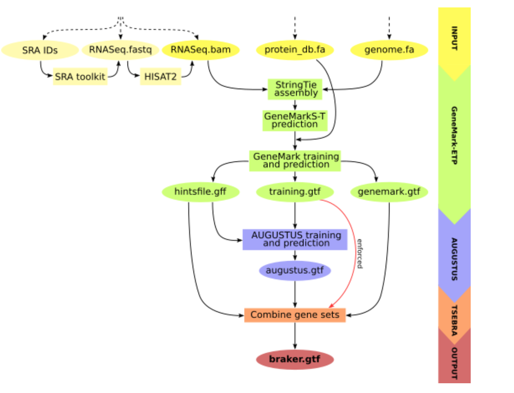

## Tipos de anotación

### Anotación estructural
Identificar posiciones de elementos fundionales: genes, tránscritos, exones, CDSs,
genes no codificantes, elementos reguladores...

### Anotación funcional
Atribuir funciones, asignar términos de ontología génica, símbolos génicos...

## Estructura génica


[@Stanke2003b]

## Estrategias

1. Basadas en modelos génicos.
2. Ensamblaje de lecturas de RNA-seq.
3. Transferencia de anotaciones.

## Desafíos

1. Ensamblajes incompletos o fragmentados.
2. Tránscritos alternativos.
3. Pseudogenes y elementos transponibles.
4. Evidencias insuficientes (datos de expresión; divergencia).
5. Combinación de múltiples evidencias.

# Elementos repetitivos

## Clasificación

{width=800px .lightbox}

## Estructura y distribución

{width=800px .lightbox}

## Procedimiento

1. [RepeatModeler](https://github.com/Dfam-consortium/RepeatModeler)
   [@Flynn2020]: Identifica repeticiones propias del ensamblaje y genera
   una colección de secuencias consenso de cada familia.
2. [RepeatMasker](https://www.repeatmasker.org/): Usa una base de datos de
   elementos repetitivos conocidos para identificar y *enmascarar* cada
   ejemplar en el ensamblaje.

# Modelos génicos

## *Hidden Markov Models* (HMM) {.smaller}

::::{.columns}
:::{.column width="50%"}


[@Stanke2003]
:::
:::{.column width="50%"}
- $IR$: región intergénica
- $E^n_{\mathrm{init}}$: primer exón codificante de varios.
- $E_{\mathrm{single}}$: único exón codificante.
- $E_{\mathrm{term}}$: exón terminal codificante.
- $E^n$: exón interno codificante.
- $I^n_{\mathrm{short}}$: intrón corto.
- $I^n_{\mathrm{fixed}}$: principio de intrón largo.
- $I^n_{\mathrm{geo}}$: resto del intrón largo.
- $DSS^n$: *donor splice site*.
- $ASS^n$: *acceptor splice site*.
- $n$: fase del último codón del exón (anterior).
:::
::::

## Entrenamiento
El HMM (matriz de transición, probabilidades de emisión) se ajusta a partir
de genes conocidos o predichos con alta confianza a partir de:

- Proteínas de una especie próxima, o bien
- Alineamientos (con *splicing*) de lecturas de RNA-seq.

## Procedimiento
Se repiten los pasos siguientes hasta convergir:

- Predicción *ab initio* de genes nuevos.
- Refinamiento del modelo.

## Principales programas

- [AUGUSTUS](https://github.com/Gaius-Augustus/Augustus)[@Stanke2003]
- [GeneMark](https://github.com/gatech-genemark/GeneMark-ETP)[@Bruna2024]
- [BRAKER](https://github.com/Gaius-Augustus/BRAKER)
- [STAR](https://github.com/alexdobin/STAR): para alinear lecturas RNA-seq al ensamblaje.

## Limitaciones

- No predicen UTRs ni ncRNAs. Sólo CDSs, normalmente.
- Necesitamos entrenar el modelo para cada especie.

# Ensamblaje de lecturas de RNA-seq

##


[@Zhernakova2013]

## Procedimiento

1. Alinear lecturas de RNA-seq al genoma, facilitando los gaps intrónicos.
2. Con suficiente cobertura, los exones quedan bien definidos.
3. Sólo se predicen tránscritos, no UTRs ni CDSs.
4. Sólo los genes expresados en la muestra pueden ser identificados.

## Principales programas

### Alineamiento de RNA-seq

- [HISAT2](https://daehwankimlab.github.io/hisat2/) [@Kim2019]
- [STAR](https://github.com/alexdobin/STAR) [@Dobin2013]

### Identificación de tránscritos

- [StringTie](https://ccb.jhu.edu/software/stringtie/) [@Shumate2022]. También cuantifica la expresión génica.
- [Scallop](https://github.com/Kingsford-Group/scallop) [@Shao2017]

# Transferencia de anotación

## Procedimiento

1. Alinear el ensamblaje a un genoma **próximo y bien anotado**.
2. Asignar las anotaciones originales a las zonas homólogas.

## Programas

- [Cactus](https://github.com/ComparativeGenomicsToolkit/cactus) [@Armstrong2020] Para alinear genomas enteros.
- [TOGA](https://github.com/hillerlab/TOGA) Para transferir la anotación.
- [Liftoff](https://github.com/agshumate/Liftoff) También para transferir la anotación.

## Limitaciones

- Calidad de la anotación original.
- Distancia evolutiva entre el ensamblaje y el genoma anotado.

# Recapitulación

##


[Freedman, 2025](https://informatics.fas.harvard.edu/resources/tutorials/how-to-annotate-a-genome/)

##



# Resultados

## Archivos GFF2/GTF (`.gtf`) {.scrollable}

```
contig1 source gene 330665 331775 15.0 + . gene_id “gene-id”; gene_name “gene-symbol”;
contig1 source transcript 330665 331775 15.0 + . transcript_id “rna-id”; gene_id “gene-id”; transcript_name “rna-symbol”;
contig1 source CDS 330665 330858 . + 2 transcript_id “rna-id”; gene_id “gene-id”;
contig1 source exon 330665 330858 . + . transcript_id “rna-id”; gene_id “gene-id”;
contig1 source CDS 331199 331775 . + 0 transcript_id “rna-id”; gene_id “gene-id”;
contig1 source exon 331199 331775 . + . transcript_id “rna-id”; gene_id “gene-id”;
contig1 source 3UTR 332802 333003 . + . transcript_id “rna-id”; gene_id “gene-id”;
```

## Archivos GFF3 (`.gff` o `.gff3`) {.scrollable}

```
contig1	source	gene	330665	331775	15.0	+	.	ID=gene-id;Name=gene-symbol
contig1	source	mRNA	330665	331775	15.0	+	.	ID=rna-id;Parent=gene-id;Name=rna-symbol
contig1	source	CDS	330665	330858	.	+	2	ID=rna-id.CDS1;Parent=rna-id
contig1	source	exon	330665	330858	.	+	.	ID=rna-id.exon1;Parent=rna-id
contig1	source	CDS	331199	331775	.	+	0	ID=rna-id.CDS2;Parent=rna-id
contig1	source	exon	331199	331775	.	+	.	ID=rna-id.exon2;Parent=rna-id
contig1	source	three_prime_UTR	332802	333003	.	+	.	ID=rna-id.three_prime_UTR1;Parent=gene-id
```

## Visualización

[UCSC Genome Browser](https://genome.ucsc.edu/)
[ENSEMBL](https://www.ensembl.org)

Existen opciones para instalar localmente.

## Evaluación del resultado


## Referencias y recursos

[https://rcac-bioinformatics.github.io/genome-annotation/aio.html](https://rcac-bioinformatics.github.io/genome-annotation/aio.html)

[https://informatics.fas.harvard.edu/resources/tutorials/how-to-annotate-a-genome/](https://informatics.fas.harvard.edu/resources/tutorials/how-to-annotate-a-genome/)

