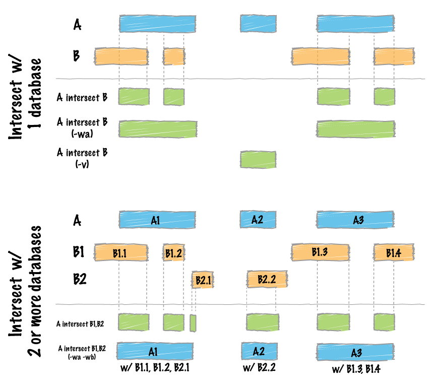

```{r setup, include=FALSE}
knitr::opts_chunk$set(echo = FALSE)
```

## Objetivos

- ¿Por qué en bioinformática se usa tanto el texto plano?
- ¿Qué consecuencias tiene la diversidad de formatos?
- ¿Qué ventajas y desventajas tienen los archivos binarios?

## Códigos IUPAC. Nucleótidos
<div class="columns-2">
  símbolo       significado
  -------       -----------
  A             Adenine
  C             Cytosine
  G             Guanine
  T (or U)      Thymine (or Uracil)
  R             A or G
  Y             C or T
  S             G or C
  W             A or T


  símbolo       significado
  -------       -----------
  K             G or T
  M             A or C
  B             C or G or T
  D             A or G or T
  H             A or C or T
  V             A or C or G
  N             any base
  . or -        gap

</div>

## Códigos IUPAC. Aminoácidos {.smaller}
<div class="columns-2">
 Símbolo    3 letras     aminoácido
 -------    --------     ----------
 A          Ala          Alanine
 C          Cys          Cysteine
 D          Asp          Aspartic Acid
 E          Glu          Glutamic Acid
 F          Phe          Phenylalanine
 G          Gly          Glycine
 H          His          Histidine
 I          Ile          Isoleucine
 K          Lys          Lysine
 L          Leu          Leucine


 Símbolo    3 letras     aminoácido
 -------    --------     ----------
 M          Met          Methionine
 N          Asn          Asparagine
 P          Pro          Proline
 Q          Gln          Glutamine
 R          Arg          Arginine
 S          Ser          Serine
 T          Thr          Threonine
 V          Val          Valine
 W          Trp          Tryptophan
 Y          Tyr          Tyrosine

</div>

## Formatos de texto plano
**Texto plano** es cualquier archivo o conjunto de datos compuesto únicamente por **caracteres**.
Se entiende por **caracteres** los símbolos legibles comunes, como letras, números, signos de puntuación, espacios y poco más. Ventaja: la codificación estándard de los caracteres (ASCII, UTF-8, etc) lo hace universal.

Ejemplos de formato plano: FASTA, FASTQ, EMBL, BED, SAM, VCF, GFF, PDB, JSON...

## Formatos binarios
Los archivos en formato **binario** incluyen al menos partes que no pueden ser correctamente interpretadas como caracteres (e.g., números reales). Ventajas: representar cualquier tipo de datos y de forma más eficiente.

Ejemplos: archivos comprimidos, PED binarios (.bed, de plink), BAM, BCF, HDF5...

## Representación de secuencias {.flexbox .vcenter .smaller}

- Los ácidos nucleicos se representan siempre de 5' a 3'.
- Los aminoácidos se representan del extremo N-terminal al C-terminal.
- Casi todos los formatos numeran las bases empezando por 1 (*1-start, fully-closed*):

{width=400px}

## Representación de secuencias {.flexbox .vcenter}

Las tablas del [navegador genómico de la UCSC](https://genome.ucsc.edu/index.html), en formato
BED numeran los nucleótidos de manera diferente, *0-start, half-open*:

{width=500px}


## Formato FASTA
```
>SEQUENCE_1
MTEITAAMVKELRESTGAGMMDCKNALSETNGDFDKAVQLLREKGLGKAAKKADRLAAEG
LVSVKVSDDFTIAAMRPSYLSYEDLDMTFVENEYKALVAELEKENEERRRLKDPNKPEHK
IPQFASRKQLSDAILKEAEEKIKEELKAQGKPEKIWDNIIPGKMNSFIADNSQLDSKLTL
MGQFYVMDDKKTVEQVIAEKEKEFGGKIKIVEFICFEVGEGLEKKTEDFAAEVAAQL
>SEQUENCE_2
SATVSEINSETDFVAKNDQFIALTKDTTAHIQSNSLQSVEELHSSTINGVKFEEYLKSQI
ATIGENLVVRRFATLKAGANGVVNGYIHTNGRVGVVIAAACDSAEVASKSRDLLRQICMH
```

Solo secuencias de un mismo tipo (proteína o ácidos nucleicos) en un archivo.

## Formato FASTQ
```
@SRR001666.1 071112_SLXA-EAS1_s_7:5:1:817:345 length=72
GGGTGATGGCCGCTGCCGATGGCGTCAAATCCCACCAAGTTACCCTTAACAACTTAAGGGTTTTCAAATAGA
+SRR001666.1 071112_SLXA-EAS1_s_7:5:1:817:345 length=72
IIIIIIIIIIIIIIIIIIIIIIIIIIIIII9IG9ICIIIIIIIIIIIIIIIIIIIIDIIIIIII>IIIIII/
@SRR001666.2 071112_SLXA-EAS1_s_7:5:1:801:338 length=72
GTTCAGGGATACGACGTTTGTATTTTAAGAATCTGAAGCAGAAGTCGATGATAATACGCGTCGTTTTATCAT
+SRR001666.2 071112_SLXA-EAS1_s_7:5:1:801:338 length=72
IIIIIIIIIIIIIIIIIIIIIIIIIIIIIIII6IBIIIIIIIIIIIIIIIIIIIIIIIGII>IIIII-I)8I
```

4 líneas por secuencia: `@`nombre, secuencia,`+`(nombre, opcional) y **calidades**. 

## Formato FASTQ. Calidades {.smaller}
```
  SSSSSSSSSSSSSSSSSSSSSSSSSSSSSSSSSSSSSSSSS.....................................................
  ..........................XXXXXXXXXXXXXXXXXXXXXXXXXXXXXXXXXXXXXXXXXXXXXX......................
  ...............................IIIIIIIIIIIIIIIIIIIIIIIIIIIIIIIIIIIIIIIII......................
  .................................JJJJJJJJJJJJJJJJJJJJJJJJJJJJJJJJJJJJJJJJ.....................
  LLLLLLLLLLLLLLLLLLLLLLLLLLLLLLLLLLLLLLLLLL....................................................
  PPPPPPPPPPPPPPPPPPPPPPPPPPPPPPPPPPPPPPPPPPPPPPPPPPPPPPPPPPPPPPPPPPPPPPPPPPPPPPPPPPPPPPPPPPPPPP
  !"#$%&'()*+,-./0123456789:;<=>?@ABCDEFGHIJKLMNOPQRSTUVWXYZ[\]^_`abcdefghijklmnopqrstuvwxyz{|}~
  |                         |    |        |                              |                     |
 33                        59   64       73                            104                   126
  0........................26...31.......40                                
                           -5....0........9.............................40 
                                 0........9.............................40 
                                    3.....9..............................41 
  0.2......................26...31........41                              
  0..................20........30........40........50..........................................93

 S - Sanger        Phred+33,  raw reads typically (0, 40)
 X - Solexa        Solexa+64, raw reads typically (-5, 40)
 I - Illumina 1.3+ Phred+64,  raw reads typically (0, 40)
 J - Illumina 1.5+ Phred+64,  raw reads typically (3, 41)
     with 0=unused, 1=unused, 2=Read Segment Quality Control Indicator (bold) 
 L - Illumina 1.8+ Phred+33,  raw reads typically (0, 41)
 P - PacBio        Phred+33,  HiFi reads typically (0, 93)
```

## Formato FASTQ. Nivel de calidad Phred.

$Q = -10 \cdot \log_{10}P$

$P = 10^{-\frac{Q}{10}}$

```{r phred}
P <- (1:10000)/10000
Q <- -10 * log10(P)
plot(P, Q, type='l', xlab='Probabilidad de error (P)', ylab='Nivel de calidad Phred (Q)')
abline(v=0.05, lty=2)
```

## [Formato EMBL](https://www.ebi.ac.uk/ena/browser/search). Cabecera {.smaller}
```
ID   X64011; SV 1; linear; genomic DNA; STD; PRO; 756 BP.
XX   
AC   X64011; S78972;
XX
SV   X64011.1
XX
DT   28-APR-1992 (Rel. 31, Created)
DT   30-JUN-1993 (Rel. 36, Last updated, Version 6)
XX
DE   Listeria ivanovii sod gene for superoxide dismutase
XX
KW   sod gene; superoxide dismutase.
XX
OS   Listeria ivanovii
OC   Bacteria; Firmicutes; Bacillus/Clostridium group;
OC   Bacillus/Staphylococcus group; Listeria.
XX
RN   [1]
RX   MEDLINE; 92140371.
RA   Haas A., Goebel W.;
RT   "Cloning of a superoxide dismutase gene from Listeria ivanovii by
RT   functional complementation in Escherichia coli and characterization of the
RT   gene product.";
RL   Mol. Gen. Genet. 231:313-322(1992).
```

## Formato EMBL. *Features Table* {.smaller}
```
FH   Key             Location/Qualifiers
FH
FT   source          1..756
FT                   /db_xref="taxon:1638"
FT                   /organism="Listeria ivanovii"
FT                   /strain="ATCC 19119"
FT                   /mol_type="genomic DNA"
FT   regulatory      95..100
FT                   /gene="sod"
FT                   /regulatory_class="ribosome_binding_site"
FT   CDS             109..717
FT                   /transl_table=11
FT                   /gene="sod"
FT                   /EC_number="1.15.1.1"
FT                   /db_xref="InterPro:IPR001189"
FT                   /db_xref="UniProtKB/Swiss-Prot:P28763"
FT                   /product="superoxide dismutase"
FT                   /protein_id="CAA45406.1"
FT                   /translation="MTYELPKLPYTYDALEPNFDKETMEIHYTKHHNIYVTKLNEAVSG
FT                   HAELASKPGEELVANLDSVPEEIRGAVRNHGGGHANHTLFWSSLSPNGGGAPTGNLKAA
FT                   IESEFGTFDEFKEKFNAAAAARFGSGWAWLVVNNGKLEIVSTANQDSPLSEGKTPVLGL
FT                   DVWEHAYYLKFQNRRPEYIDTFWNVINWDERNKRFDAAK"

```

## Formato EMBL. Secuencia {.smaller}
```
SQ   Sequence 756 BP; 247 A; 136 C; 151 G; 222 T; 0 other;
     cgttatttaa ggtgttacat agttctatgg aaatagggtc tatacctttc gccttacaat        60
     gtaatttctt ttcacataaa taataaacaa tccgaggagg aatttttaat gacttacgaa       120
     ttaccaaaat taccttatac ttatgatgct ttggagccga attttgataa agaaacaatg       180
     gaaattcact atacaaagca ccacaatatt tatgtaacaa aactaaatga agcagtctca       240
     ggacacgcag aacttgcaag taaacctggg gaagaattag ttgctaatct agatagcgtt       300
     cctgaagaaa ttcgtggcgc agtacgtaac cacggtggtg gacatgctaa ccatacttta       360
     ttctggtcta gtcttagccc aaatggtggt ggtgctccaa ctggtaactt aaaagcagca       420
     atcgaaagcg aattcggcac atttgatgaa ttcaaagaaa aattcaatgc ggcagctgcg       480
     gctcgttttg gttcaggatg ggcatggcta gtagtgaaca atggtaaact agaaattgtt       540
     tccactgcta accaagattc tccacttagc gaaggtaaaa ctccagttct tggcttagat       600
     gtttgggaac atgcttatta tcttaaattc caaaaccgtc gtcctgaata cattgacaca       660
     ttttggaatg taattaactg ggatgaacga aataaacgct ttgacgcagc aaaataatta       720
     tcgaaaggct cacttaggtg ggtcttttta tttcta                                 756
//
```

## Formato GTF/GFF (*General Feature Format*) {.smaller}
```
##gff-version 3.1.26
##sequence-region ctg123 1 1497228
ctg123 . gene            1000 9000  .  +  .  ID=gene00001;Name=EDEN
ctg123 . TF_binding_site 1000 1012  .  +  .  Parent=gene00001
ctg123 . mRNA            1050 9000  .  +  .  ID=mRNA00001;Parent=gene00001
ctg123 . mRNA            1050 9000  .  +  .  ID=mRNA00002;Parent=gene00001
ctg123 . mRNA            1300 9000  .  +  .  ID=mRNA00003;Parent=gene00001
ctg123 . exon            1300 1500  .  +  .  Parent=mRNA00003
ctg123 . exon            1050 1500  .  +  .  Parent=mRNA00001,mRNA00002
ctg123 . exon            3000 3902  .  +  .  Parent=mRNA00001,mRNA00003
ctg123 . exon            5000 5500  .  +  .  Parent=mRNA00001,mRNA00002,mRNA00003
ctg123 . exon            7000 9000  .  +  .  Parent=mRNA00001,mRNA00002,mRNA00003
ctg123 . CDS             1201 1500  .  +  0  ID=cds00001;Parent=mRNA00001
ctg123 . CDS             3000 3902  .  +  0  ID=cds00001;Parent=mRNA00001
ctg123 . CDS             5000 5500  .  +  0  ID=cds00001;Parent=mRNA00001
ctg123 . CDS             7000 7600  .  +  0  ID=cds00001;Parent=mRNA00001
ctg123 . CDS             1201 1500  .  +  0  ID=cds00002;Parent=mRNA00002
ctg123 . CDS             5000 5500  .  +  0  ID=cds00002;Parent=mRNA00002
ctg123 . CDS             7000 7600  .  +  0  ID=cds00002;Parent=mRNA00002
ctg123 . CDS             3301 3902  .  +  0  ID=cds00003;Parent=mRNA00003
ctg123 . CDS             5000 5500  .  +  1  ID=cds00003;Parent=mRNA00003
...
```

## Format GTF/GFF (General Feature Format) {.smaller}
[https://github.com/The-Sequence-Ontology/Specifications/blob/master/gff3.md]

Columna   Descripción
-------   ---------------
1         Identificador de secuencia.
2         Fuente de la anotación.
3         Tipo.
4-5       Principio y fin.
6         Puntuación.
7         Cadena.
8         Fase (solo para CDS).
9         Lista de atributos

## Formato GTF/GFF

Ejemplo de código de R para leer un archivo GFF3:

```{r gff1, echo=TRUE, eval=FALSE}
# Cargar la libreria:
library('ape')
# Definir la localización del archivo en dos variables "d" y "f":
d <- "https://ftp.ensembl.org/pub/release-86/gff3/homo_sapiens/"
f <- "Homo_sapiens.GRCh38.86.chromosome.MT.gff3.gz"
# Descargar el archivo:
download.file(paste0(d, f), "mt_gff3.gz")
# Leer el archivo a la tabla "gff.mito":
gff.mito <- read.gff("mt_gff3.gz", GFF3 = TRUE)
# Operar sobre "gff.mito", por ejemplo, tabular los tipos:
table(gff.mito$type)
# O extraer los inicios de todos los exones:
gff.mito$start[gff.mito$type == "exon"]
```

##  Formato GTF/GFF

```{r gff2, echo=TRUE, eval=TRUE}
library('ape')
d <- "https://ftp.ensembl.org/pub/release-86/gff3/homo_sapiens/"
f <- "Homo_sapiens.GRCh38.86.chromosome.MT.gff3.gz"
download.file(paste0(d, f), "mt_gff3.gz")
gff.mito <- read.gff("mt_gff3.gz", GFF3 = TRUE)
table(gff.mito$type)
gff.mito$start[gff.mito$type == "exon"]
```

## Formato BED (*Browser Extensible Data*) {.smaller}
(https://genome.ucsc.edu/FAQ/FAQformat.html#format1)

```
browser position chr7:127471196-127495720
browser hide all
track name="ItemRGBDemo" description="Item RGB demonstration" visibility=2 itemRgb="On"
chr7    127471196  127472363  Pos1  0  +  127471196  127472363  255,0,0
chr7    127472363  127473530  Pos2  0  +  127472363  127473530  255,0,0
chr7    127473530  127474697  Pos3  0  +  127473530  127474697  255,0,0
chr7    127474697  127475864  Pos4  0  +  127474697  127475864  255,0,0
chr7    127475864  127477031  Neg1  0  -  127475864  127477031  0,0,255
chr7    127477031  127478198  Neg2  0  -  127477031  127478198  0,0,255
chr7    127478198  127479365  Neg3  0  -  127478198  127479365  0,0,255
chr7    127479365  127480532  Pos5  0  +  127479365  127480532  255,0,0
chr7    127480532  127481699  Neg4  0  -  127480532  127481699  0,0,255
```

## Bedtools
<div class="centered">
(https://bedtools.readthedocs.io/en/latest/)

{width=500px}
</div>

## Formato BED

```{r bed, echo=TRUE}
suppressWarnings(suppressMessages(library('genomation')))
tab.file1 <- system.file("extdata/tab1.bed", package = "genomation")
readGeneric(tab.file1, header = TRUE, keep.all.metadata = TRUE)
```

[genomation](https://www.bioconductor.org/packages/release/bioc/vignettes/genomation/inst/doc/GenomationManual.html)

## [Formato SAM](https://en.wikipedia.org/wiki/SAM_(file_format). Introducción
```
Coor      12345678901234  5678901234567890123456789012345
ref       AGCATGTTAGATAA**GATAGCTGTGCTAGTAGGCAGTCAGCGCCAT

+r001/1         TTAGATAAAGGATA*CTG
+r002          aaaAGATAA*GGATA
+r003        gcctaAGCTAA
+r004                      ATAGCT..............TCAGC
-r003                             ttagctTAGGC
-r001/2                                         CAGCGGCAT
```

Alineamiento de 6 lecturas cortas a un genoma de referencia.
r001/1 i r001/2: lecturas apareadas.
Minúsculas: extremos no alineados.

## Formato SAM. Ejemplo {.smaller}
```
@HD VN:1.6 SO:coordinate
@SQ SN:ref LN:45
r001   99 ref  7 30 8M2I4M1D3M  = 37  39 TTAGATAAAGGATACTG *
r002    0 ref  9 30 3S6M1P1I4M  *  0   0 AAAAGATAAGGATA    *
r003    0 ref  9 30 5S6M        *  0   0 GCCTAAGCTAA       * SA:Z:ref,29,-,6H5M,17,0;
r004    0 ref 16 30 6M14N5M     *  0   0 ATAGCTTCAGC       *
r003 2064 ref 29 17 6H5M        *  0   0 TAGGC             * SA:Z:ref,9,+,5S6M,30,1;
r001  147 ref 37 30 9M          =  7 -39 CAGCGGCAT         * NM:i:1
```

La cadena CIGAR **8M2I4M1D3M** describe cómo se alinea la secuencia:

  - 8M: 8 nucleótidos alineados (*matched*).
  - 2I: 2 nucleótidos insertados.
  - 4M: 4 nucleótidos alineados.
  - 1D: 1 nucleótido eliminado (*deleted*).
  - 3M: 3 nucleótidos alineados.

"S" (*soft clipped*) y "H" (*hard clipped*) indican extremos no alineados.

## Formato SAM. Campos obligatorios {.smaller}
 Columna  Nombre   Tipo        Descripción
--------  ------   ----        -----------
1         QNAME    caracteres  Nombre de la secuencia corta
2         FLAG     número      Marcas binarias
3         RNAME    caracteres  Nombre de la secuencia de referencia
4         POS      número      Posición izquierda de mapeo (base 1)
5         MAPQ     número      Calidad de mapaje (escala Phred)
6         CIGAR    caracteres  Descripción de alineamiento codificada
7         RNEXT    caracteres  Referencia donde mapea la pareja (si hay)
8         PNEXT    número      Posición de la pareja (si hay)
9         TLEN     número      Longitud observada del fragmento
10        SEQ      caracteres  Secuencia del segmento
11        QUAL     caracteres  ASCII de calidades de bases (+33, en Phred)

## Formato SAM. Marcas binarias {.bigger}
<div class="centered">
**Hay 10 tipos**

**de personas:**

**las que entienden**

**binario y**

**las que no**
</div>

## Formato SAM. Marcas binarias {.smaller}

 Decimal       Binario      Descripción
--------  ------------      ------------
     1    000000000001      Lecturas emparejadas.
     2    000000000010      Alineamiento concordante.
     4    000000000100      Lectura no mapeada.
     8    000000001000      Pareja no mapeada.
    16    000000010000      SEQ invertida y complementada.
    32    000000100000      SEQ de pareja invertida-complementada.
    64    000001000000      Primera lectura de la pareja.
   128    000010000000      Última lectura de la pareja.
   256    000100000000      Alineamiento secundario.
   512    001000000000      No pasa los filtros de calidad.

## Formato VCF {.smaller}
```
##fileformat=VCFv4.0
##fileDate=20110705
##reference=1000GenomesPilot-NCBI37
##phasing=partial
##INFO=<ID=NS,Number=1,Type=Integer,Description="Number of Samples With Data">
##INFO=<ID=DP,Number=1,Type=Integer,Description="Total Depth">
##INFO=<ID=AF,Number=.,Type=Float,Description="Allele Frequency">
##INFO=<ID=AA,Number=1,Type=String,Description="Ancestral Allele">
##INFO=<ID=DB,Number=0,Type=Flag,Description="dbSNP membership, build 129">
##INFO=<ID=H2,Number=0,Type=Flag,Description="HapMap2 membership">
##FILTER=<ID=q10,Description="Quality below 10">
##FILTER=<ID=s50,Description="Less than 50% of samples have data">
##FORMAT=<ID=GQ,Number=1,Type=Integer,Description="Genotype Quality">
##FORMAT=<ID=GT,Number=1,Type=String,Description="Genotype">
##FORMAT=<ID=DP,Number=1,Type=Integer,Description="Read Depth">
##FORMAT=<ID=HQ,Number=2,Type=Integer,Description="Haplotype Quality">
#CHROM POS    ID        REF  ALT     QUAL FILTER INFO                              FORMAT      Sample1        Sample2        Sample3
2      4370   rs6057    G    A       29   .      NS=2;DP=13;AF=0.5;DB;H2           GT:GQ:DP:HQ 0|0:48:1:52,51 1|0:48:8:51,51 1/1:43:5:.,.
2      7330   .         T    A       3    q10    NS=5;DP=12;AF=0.017               GT:GQ:DP:HQ 0|0:46:3:58,50 0|1:3:5:65,3   0/0:41:3
2      110696 rs6055    A    G,T     67   PASS   NS=2;DP=10;AF=0.333,0.667;AA=T;DB GT:GQ:DP:HQ 1|2:21:6:23,27 2|1:2:0:18,2   2/2:35:4
2      130237 .         T    .       47   .      NS=2;DP=16;AA=T                   GT:GQ:DP:HQ 0|0:54:7:56,60 0|0:48:4:56,51 0/0:61:2
2      134567 microsat1 GTCT G,GTACT 50   PASS   NS=2;DP=9;AA=G                    GT:GQ:DP    0/1:35:4       0/2:17:2       1/1:40:3
```

## Formato VCF {.smaller}
```
=VCFv4.0
0110705
1000GenomesPilot-NCBI37
rtial
S,Number=1,Type=Integer,Description="Number of Samples With Data">
P,Number=1,Type=Integer,Description="Total Depth">
F,Number=.,Type=Float,Description="Allele Frequency">
A,Number=1,Type=String,Description="Ancestral Allele">
B,Number=0,Type=Flag,Description="dbSNP membership, build 129">
2,Number=0,Type=Flag,Description="HapMap2 membership">
=q10,Description="Quality below 10">
=s50,Description="Less than 50% of samples have data">
=GQ,Number=1,Type=Integer,Description="Genotype Quality">
=GT,Number=1,Type=String,Description="Genotype">
=DP,Number=1,Type=Integer,Description="Read Depth">
=HQ,Number=2,Type=Integer,Description="Haplotype Quality">
  ID        REF  ALT     QUAL FILTER INFO                              FORMAT      Sample1        Sample2        Sample3
  rs6057    G    A       29   .      NS=2;DP=13;AF=0.5;DB;H2           GT:GQ:DP:HQ 0|0:48:1:52,51 1|0:48:8:51,51 1/1:43:5:.,.
  .         T    A       3    q10    NS=5;DP=12;AF=0.017               GT:GQ:DP:HQ 0|0:46:3:58,50 0|1:3:5:65,3   0/0:41:3
6 rs6055    A    G,T     67   PASS   NS=2;DP=10;AF=0.333,0.667;AA=T;DB GT:GQ:DP:HQ 1|2:21:6:23,27 2|1:2:0:18,2   2/2:35:4
7 .         T    .       47   .      NS=2;DP=16;AA=T                   GT:GQ:DP:HQ 0|0:54:7:56,60 0|0:48:4:56,51 0/0:61:2
7 microsat1 GTCT G,GTACT 50   PASS   NS=2;DP=9;AA=G                    GT:GQ:DP    0/1:35:4       0/2:17:2       1/1:40:3
```

## Formato VCF {.smaller}
```
 
 
ilot-NCBI37
 
ype=Integer,Description="Number of Samples With Data">
ype=Integer,Description="Total Depth">
ype=Float,Description="Allele Frequency">
ype=String,Description="Ancestral Allele">
ype=Flag,Description="dbSNP membership, build 129">
ype=Flag,Description="HapMap2 membership">
tion="Quality below 10">
tion="Less than 50% of samples have data">
,Type=Integer,Description="Genotype Quality">
,Type=String,Description="Genotype">
,Type=Integer,Description="Read Depth">
,Type=Integer,Description="Haplotype Quality">
REF  ALT     QUAL FILTER INFO                              FORMAT      Sample1        Sample2        Sample3
G    A       29   .      NS=2;DP=13;AF=0.5;DB;H2           GT:GQ:DP:HQ 0|0:48:1:52,51 1|0:48:8:51,51 1/1:43:5:.,.
T    A       3    q10    NS=5;DP=12;AF=0.017               GT:GQ:DP:HQ 0|0:46:3:58,50 0|1:3:5:65,3   0/0:41:3
A    G,T     67   PASS   NS=2;DP=10;AF=0.333,0.667;AA=T;DB GT:GQ:DP:HQ 1|2:21:6:23,27 2|1:2:0:18,2   2/2:35:4
T    .       47   .      NS=2;DP=16;AA=T                   GT:GQ:DP:HQ 0|0:54:7:56,60 0|0:48:4:56,51 0/0:61:2
GTCT G,GTACT 50   PASS   NS=2;DP=9;AA=G                    GT:GQ:DP    0/1:35:4       0/2:17:2       1/1:40:3
```

## Formato VCF {.smaller}
```
 
 
 
 
Description="Number of Samples With Data">
Description="Total Depth">
scription="Allele Frequency">
escription="Ancestral Allele">
cription="dbSNP membership, build 129">
cription="HapMap2 membership">
y below 10">
han 50% of samples have data">
r,Description="Genotype Quality">
,Description="Genotype">
r,Description="Read Depth">
r,Description="Haplotype Quality">
 QUAL FILTER INFO                              FORMAT      Sample1        Sample2        Sample3
 29   .      NS=2;DP=13;AF=0.5;DB;H2           GT:GQ:DP:HQ 0|0:48:1:52,51 1|0:48:8:51,51 1/1:43:5:.,.
 3    q10    NS=5;DP=12;AF=0.017               GT:GQ:DP:HQ 0|0:46:3:58,50 0|1:3:5:65,3   0/0:41:3
 67   PASS   NS=2;DP=10;AF=0.333,0.667;AA=T;DB GT:GQ:DP:HQ 1|2:21:6:23,27 2|1:2:0:18,2   2/2:35:4
 47   .      NS=2;DP=16;AA=T                   GT:GQ:DP:HQ 0|0:54:7:56,60 0|0:48:4:56,51 0/0:61:2
 50   PASS   NS=2;DP=9;AA=G                    GT:GQ:DP    0/1:35:4       0/2:17:2       1/1:40:3
```

## Formato VCF {.smaller}
```
 
 
 
 
Number of Samples With Data">
Total Depth">
llele Frequency">
Ancestral Allele">
SNP membership, build 129">
pMap2 membership">
 
amples have data">
n="Genotype Quality">
="Genotype">
n="Read Depth">
n="Haplotype Quality">
 INFO                              FORMAT      Sample1        Sample2        Sample3
 NS=2;DP=13;AF=0.5;DB;H2           GT:GQ:DP:HQ 0|0:48:1:52,51 1|0:48:8:51,51 1/1:43:5:.,.
 NS=5;DP=12;AF=0.017               GT:GQ:DP:HQ 0|0:46:3:58,50 0|1:3:5:65,3   0/0:41:3
 NS=2;DP=10;AF=0.333,0.667;AA=T;DB GT:GQ:DP:HQ 1|2:21:6:23,27 2|1:2:0:18,2   2/2:35:4
 NS=2;DP=16;AA=T                   GT:GQ:DP:HQ 0|0:54:7:56,60 0|0:48:4:56,51 0/0:61:2
 NS=2;DP=9;AA=G                    GT:GQ:DP    0/1:35:4       0/2:17:2       1/1:40:3
```

## Formato PDB (*Protein Data Bank*) {.smaller}
```
  HEADER    EXTRACELLULAR MATRIX                    22-JAN-98   1A3I
  TITLE     X-RAY CRYSTALLOGRAPHIC DETERMINATION OF A COLLAGEN-LIKE
  TITLE     2 PEPTIDE WITH THE REPEATING SEQUENCE (PRO-PRO-GLY)
  ...
  EXPDTA    X-RAY DIFFRACTION
  AUTHOR    R.Z.KRAMER,L.VITAGLIANO,J.BELLA,R.BERISIO,L.MAZZARELLA,
  ...
  REMARK 350 BIOMOLECULE: 1
  REMARK 350 APPLY THE FOLLOWING TO CHAINS: A, B, C
  REMARK 350   BIOMT1   1  1.000000  0.000000  0.000000        0.00000
  ...
  SEQRES   1 A    9  PRO PRO GLY PRO PRO GLY PRO PRO GLY
  SEQRES   1 B    6  PRO PRO GLY PRO PRO GLY
  ...
  ATOM      1  N   PRO A   1       8.316  21.206  21.530  1.00 17.44           N
  ATOM      2  CA  PRO A   1       7.608  20.729  20.336  1.00 17.44           C
  ...
  HETATM  130  C   ACY   401       3.682  22.541  11.236  1.00 21.19           C
  HETATM  131  O   ACY   401       2.807  23.097  10.553  1.00 21.19           O
```

## *Hierarchical data format*
<div align='right'>
{width=300px}
</div>

- Desarrollado por [*The HDF Group*](https://www.hdfgroup.org/).
- Es un formato *abierto*. Actualment en versión 5.
- Almacenaje de muchos datos, de cualquier tipo.
- Metadatos incluidos: el archivo se describe a sí mismo.
- Es binario. Requiere programas específicos.

## Herramientas y ambientes de computación

- Entornos gráficos: [Galaxy](https://usegalaxy.eu/)
- Lenguajes de programación: Python, R, Julia, bash, awk...
- Control de versiones: git
- Gestión de ambientes: conda, pip
- La nube: AWS, etc.

[](https://mybinder.org/v2/gh/IgnasiLucas/T2_testR/HEAD)
