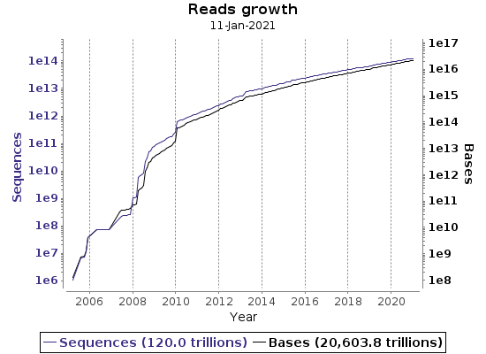

```{r setup, include=FALSE}
knitr::opts_chunk$set(echo = FALSE)
```

## Objetivos
- ¿Para qué se comparten los datos?
- Cómo buscar información en el *European Nucleotide Archive*.
  - ¿Qué tipos de datos puedo buscar?
  - ¿Qué información puedo obtener de cada tipo de datos?
  - ¿Para qué sirven las *búsquedas programáticas*?

## Contexto filosófico
- La biología es una ciencia **empírica**.
- **Datos**: punto de contacto entre hipótesis y realidad.
- **Preservar** y **compartir** los datos es necesario.
- **Datos primarios** $\rightarrow$ Análisis $\rightarrow$ **Datos secundarios**
- **Metadata**: Conocer el **contexto** para usar los datos.

## Metadata. *Minimum Information about a Microarray Experiment*
<div class="centered">


6 tipos de datos en MIAME y enlaces externos.
</div>

## Contexto histórico {.smaller}
- **1979** Los Alamos Sequence Database.
- **1980** EMBL Data Library.
- **1982** Genbank (EEUU) y distribución de la EMBL Data Library.
- **1986** DNA Data Bank of Japan (DDBJ).
- **1988** National Center for Biotechnology Information (NCBI).
- **1990** Proyecto Genoma Humano. EMBL Data Library $\rightarrow$ EMBL Nucleotide Sequence Database.
- **1992** NCBI se hace cargo de Genbank.
- **2005** Formalización de la *International Nucleotide Sequence Database Collaboration* (INSDC).
- **2008** European Nucleotide Archive = EMBL Nucleotide Sequence Database + Trace Archive + Short Read Archive.
- **2011** BioProject.

## *International Nucleotide Sequence Database Collaboration*
<div class="centered">
{width=500px}
</div>

## *European Nucleotide Archive* (ENA)

  "ENA is an open, supported platform for the management, sharing, integration, archiving and dissemination of sequence data"

[Página principal](https://www.ebi.ac.uk/ena/browser/home)

[Tutoriales y guías](https://www.ebi.ac.uk/ena/browser/guides)


## ENA. Contenidos
{width=800px}

## ENA. Estadísticas {.columns-2}
<div class="float: left; width: 50%;">
{width=400px}
</div>

<div class="float: right; width: 50%;">
{width=400px}
</div>

## ENA. Estadísticas {.columns-2}
<div class="float: left; width: 50%;">
{width=400px}
</div>

<div class="float: right; width: 50%;">
{width=400px}
</div>

## ENA. [Búsqueda avanzada](https://www.ebi.ac.uk/ena/browser/advanced-search)

- Tipo de datos deseados.
- Filtros o términos de la consulta (*Query*).
- Inclusión/exclusion de registros conocidos (opcional).
- Campos de información solicitados.
- Número máximo de resultados.

## ENA. Tipos de datos {.smaller}
- Studies
- Studies used for raw reads
- Studies used for nucleotide sequence analyses from reads
- Samples
- Environmental samples
- Experiments used for raw reads
- Raw reads
- Nucleotide sequence analyses from reads
- Genome assemblies
- Genome assembly contig sets (WGS)
- Transcriptome assembly contig sets (TSA)
- Nucleotide sequences
- Protein coding sequences
- Non-coding sequences
- Taxonomic classification

## ENA. Filtros {.smaller}
- **Taxonomy and related**: taxonomia NCBI, división taxonómica, etc.
- **Geographical location**: Área rectangular o circular sobre mapa o país.
- **Geography**: Altitud.
- **Collection event information**: fecha de recolección, etc.
- **Sampling information**: identificador de muestra, etc.
- **Sample state and conditions**: tejido, sexo, edad, tipo celular...
- **Database record**: fecha de publicación, tipo de datos, palabras clave...
- **Accessions**: número de registro de la muestra, de la secuencia...
- ...

## ENA. Ejemplos de búsquedas avanzadas
- Lecturas cortas de genoma de Neandertal.
- Estudios que contengan muestras humanas de Albania.
- Mujeres participantes en el *1000 Genomes Project*.
- Genomas de cloroplastos de coníferas.
- Lecturas cortas nuevas no humanas de enero.

**Algunas búsquedas no se ajustan al esquema de la búsqueda avanzada**

## EBI [*Search*](https://www.ebi.ac.uk/ebisearch/overview.ebi/about)
Búsqueda de texto libre en múltiples bases de datos. Ejemplos:

- covid-19 OR sars-cov-2 OR (2019 AND ncov)
- escherichia NOT coli
- prostate AND cancer
- publication_date:[2010 TO 2011]

## Búsquedas programáticas. ENA Portal

Busca lecturas cortas de SARS-Cov2 de muestras italianas, mostrando:
número de registro, número de bases, fecha de recolección, país,
enlace ftp al archivo fastq, código md5 del archivo y número de muestra,
todo en formato `tsv`:

```
curl -X POST -H "Content-Type: application/x-www-form-urlencoded" \
-d 'result=read_run&query=tax_eq(2697049)%20AND%20country%3D%22Italy%22&
fields=accession%2Cbase_count%2Ccollection_date%2Ccountry%2Cfastq_ftp%2C
fastq_md5%2Cread_count%2Csample_accession&format=tsv' \
"https://www.ebi.ac.uk/ena/portal/api/search"
```

## Búsquedas programáticas. ENA Browser

Busca las 5 secuencias no codificantes más relevantes para los términos
*tRNA* y *Listeria*:

```
curl -X GET --header 'Accept: application/json' \
'https://www.ebi.ac.uk/ena/browser/api/text/textsearch?domain=non-coding
&query=tRNA%20AND%20Listeria&limit=5'
```

## Conclusiones
- Los datos son para compartirlos.
- Una base de datos integrada facilita los metaanálisis.
- Consultar las bases de datos de forma automática ayuda a:
  - Repetir la búsqueda y actualizar los resultados.
  - Comunicar con precisión el método de búsqueda.
  - Construir nuevos servicios web.