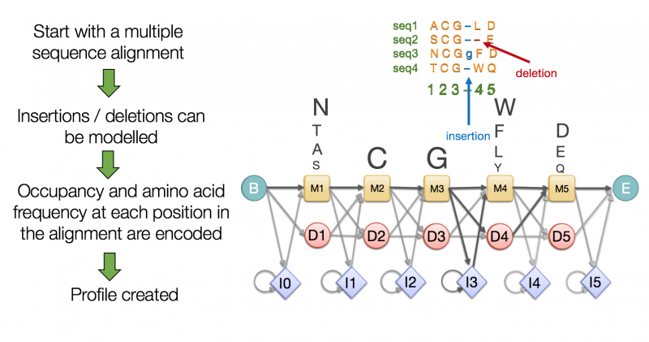

```{r setup, include=FALSE}
knitr::opts_chunk$set(echo = FALSE)
```

## Objetivos

- UniProt
- Interpro
- ENSEMBL
- OrthoDB

## [UniProt](https://www.uniprot.org/)
  "The Universal Protein Resource (UniProt) is a comprehensive resource for protein sequence and annotation data. The UniProt databases are the UniProt Knowledgebase (UniProtKB), the UniProt Reference Clusters (UniRef), and the UniProt Archive (UniParc). The UniProt consortium and host institutions EMBL-EBI, SIB and PIR are committed to the long-term preservation of the UniProt databases."

## UniProt
<div class="centered">

</div>

## UniProt. Cuestionario.
- ¿En qué sección de UniProt buscarías información sobre la función de una proteína?
- ¿Qué sección és menos *redundante*?
- ¿Por qué coexisten TrEMBL y Swiss-Prot?
- ¿De dónde salen los datos primarios?

## [Interpro](https://www.ebi.ac.uk/interpro/)
{width=600px}

## Interpro. Tipos de registros

- **Familia**: Proteínas homólogas con secuencias, estructuras y funciones relacionadas.
- **Dominio**: Unidad funcional y estructural de las proteínas.
- **Sitio**: Motivos cortos: sitios de unión, sitios activos...
- **Repetición**: Secuencia de <50 aa. repetida muchas veces en una proteína.
- **Superfamilia**: Proteínas homólogas, aunque las secuencias no se parezcan.
- **No integrados**: Registros de las bases de datos participantes, no incluídos en Interpro.

## Modelo de Markov

<div style="float: left; width: 50%;">
{width=350px}
</div>

<div style="float: right; width: 50%;">
{width=300px}

$a_{st} = P(x_i = t | x_{i-1}=s)$

</div>

## Modelo de Markov Oculto (HMM)

<div class="centered">
{width=500px}

Ejemplo del casino con dos dados, uno justo y otro *cargado*,
con probabilidades de *emisión* diferentes. No sabemos en cada
momento con qué dado se está jugando.
</div>

## Modelo de Markov Oculto (HMM)

{width=750px}

A partir de los datos visibles, podemos ajustar los parámetros del modelo de Markov
y predecir los estados ocultos a lo largo de la cadena de eventos.

## Modelo de Markov Ocultos (HMM)
<div class="centered">

</div>

## [ENSEMBL](https://www.ensembl.org)
<div class="centered">
**Secuencias genómicas**

$\downarrow$

**Predicción automática de genes**

$\downarrow$

**Base de datos MySQL**

$\downarrow$

**Análisis y visualización**
</div>

## ENSEMBL
- Servicio del EMBL-EBI.
- Originalmente para genoma humano.
- Incluye genomas de 311 especies.
- La base de datos y sus herramientas estan disponibles.

## ENSEMBL. Acceso a los datos
- Consulta y visualización.
- Opciones de descarga de resultados de búsqueda.
- Descarga de tablas por ftp.
- Perl API.
- REST API.

## [ENSEMBL](https://www.ensembl.org)
{width=800px}

## [OrthoDB](https://www.orthodb.org)

{width=700px}

<sup> Fuente: [Kuznetsov, D. et al. 2023](https://doi.org/10.1093/nar/gkac998) </sup>

**A** Se puede limitar la búsqueda por grupo taxonómico.
**B** El grupo de ortología dispone de un diagrama interactivo.

## OrthoDB

{width=700px}
<sup>Fuente: [Kuznetsov, D. et al. 2023](https://doi.org/10.1093/nar/gkac998) </sup>

**C** La visualización del gen permite acceder a genes ortólogos.
**D** Se puede buscar el ortólogo de una especie concreta.

## OrthoDB

- Los datos primarios són las proteínas de UniProtKB.
- Utiliza el [programa orthologer](https://orthologer.ezlab.org/) para agrupar proteínas ortólogas.
- El programa [BUSCO](https://busco.ezlab.org/) utiliza a su vez OrthoDB para determinar qué genes suelen estar en copia única en la mayor parte de organismos de un grupo.