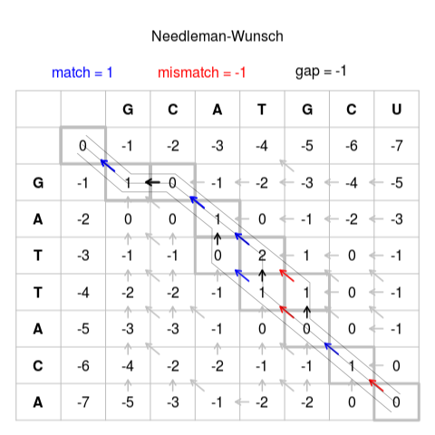
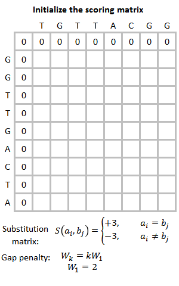

```{r setup, include=FALSE}
knitr::opts_chunk$set(echo = FALSE)
```

## Objetivos
- Motivación y contexto
- Alineamientos de pares de secuencias
  - Alineamientos globales
  - Alineamientos locales
  - Matrices de similitud
- Alineamientos múltiples
  - Clustal
  - Muscle

# Motivación y contexto

## Glosario

**Homología**: Relación entre secuencias que descienden de un ancestro común. No es cuantificable.

**Similitud**: Grado (cuantificable) en que se parecen dos secuencias.

**Identidad**: El porcentaje de resíduos idénticos entre dos secuencias alineadas es una entre muchas posibles medidas de similitud.

**Alinear**: Colocar secuencias de DNA, RNA o proteínas para buscar las regiones de similitud que pueda haber entre ellas como consecuencia de sus relaciones funcionales, estructurales o evolutivas.

## Ejemplo
<div class="centered">
`GTCGTAGAATA`

`CACGTAG--TA`
</div>

## Aplicaciones
- Identificar homología para inferencia filogenética o funcional.
- Localizar el origen genómico de una secuencia corta (mapear).
- Identificar intrones en la secuencia de un gen.
- Reconocer sintenia y reordenación cromosómica.
- Identificar dominios proteicos conservados.
- Encontrar genes en un genoma secuenciado.
- etc.

## Paradigma de análisis bioinformático
- Alinear es un problema de **optimización**.
- El alineamiento *óptimo* depende de la finalidad.
- Es habitual utilizar procedimientos **heurísticos**.
- Es necesario evaluar la calidad del resultado.
- Los errores del alineamiento se arrastran en los pasos siguientes.

# Alineamiento de pares de secuencias

## Alineamientos globales
<div class="centered">
{width=300px}

Algoritmo de Needleman-Wunsch (programación dinámica).
Garantiza el alineamiento *óptimo*.
La puntución total es la suma de las puntuaciones de cada posición.
</div>

## Alineamientos globales
<div class="centered">
{width=300px}

Tres alineamientos de puntuación óptima de 0:
```{}
GCATG-CU      GCA-TGCU      GCAT-GCU
G-ATTACA      G-ATTACA      G-ATTACA
```

</div>

## Esquemas de puntuación
- Simple:
  - Coincidencia: +1
  - *Mismatch*: -1
  - *indel*: -1
- Para favorecer alineamientos con pocos gaps más largos en lugar de muchos y cortos, se penaliza más la **aparición** que la **extensión** del *gap*.
- Matrices de similitud: puntúan cada cambio posible y definen lo que entendemos por un *buen* alineamiento.

## Matrices de similitud
```{r, results='asis'}
library(knitr)
library(kableExtra)
A <- data.frame(A=c(1,-1,-1,-1),
                G=c(-1,1,-1,-1),
                C=c(-1,-1,1,-1),
                T=c(-1,-1,-1,4))
row.names(A) <- c('A','G','C','T')
kable(A) %>% kable_styling(bootstrap_options = "basic",
                full_width = F)
```

Este esquema de puntuación valora más las coincidencias de timinas en el alineamiento.

## Matriz PAM
<div class="centered">
{width=300px}

Margaret Dayhoff introdujo las matrices PAM en 1978 para el alineamiento de proteínas.

Una matriz PAM$_n$ corresponde al tiempo suficiente para que *n* mutaciones hayan aparecido entre 100 aminoácidos.
</div>

## PAM250 {.smaller .flexbox .vcenter}
```{r}
suppressMessages(library(Biostrings))
data(PAM250)
kable(PAM250[0:20,0:20]) %>% kable_styling(bootstrap_options = c('basic','condensed'),
                full_width = F)
```

## BLOSUM (*block substitution matrix*)
<div class="centered">
{width=600px}

BLOSUM62
</div>

## BLOSUM vs PAM
```{r}
M <- data.frame(PAM = c('PAM100','PAM120','PAM160','PAM200','PAM250'),
                BLOSUM = paste('BLOSUM', c('90','80','62','50','45'), sep=''))
kable(M, caption="Correspondencia aproximada entre matrices PAM y BLOSUM") %>% 
  kable_styling(bootstrap_options = 'basic', full_width=TRUE)
```

## Alineamientos locales
<div class="centered">
{width=500px}
</div>

## Algoritmo de Smith-Waterman
<div class="centered">

</div>

# Alineamientos múltiples

## CLUSTAL
- Diferentes versiones: CLUSTAL (1988), CLUSTAL V (1992), CLUSTAL W (1994), CLUSTAL X (1997), CLUSTAL 2 (2007), CLUSTAL $\Omega$ (2011).
- **Alineamiento progresivo**: se empieza alineando las parejas de secuencias más semejantes.
- El **árbol guía** que determina el orden de incorporación de secuencias en el alineamiento se obtiene de una comparación inicial de todos los pares de secuencias.

http://www.clustal.org/

## MUSCLE {.smaller}
<div class="centered">
{width=600.px}

https://www.drive5.com/muscle/manual/index.html
</div>

## Otros programas
```{r}
M <- data.frame(Nombre = c('DECIPHER', 'MAFFT', 'T-Coffee'),
                Descripción = c('Alineamiento global, progresivo e iterativo en R',
                                'Alineamiento local y global, progresivo e iterativo',
                                'Alineamiento local y global, progresivo. Puede usar estructura 3D. Evalúa el alineamiento'),
                Licencia = c('GPL', 'BSD', 'GPL2'))
M %>% kable() %>% kable_styling(bootstrap_options='basic')
```
