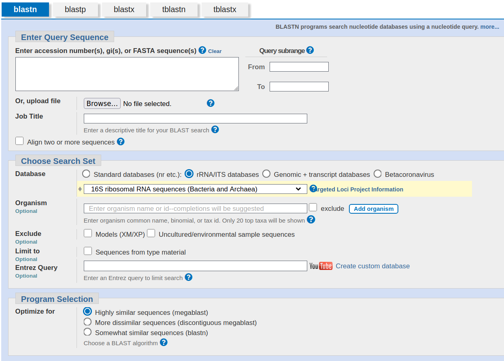
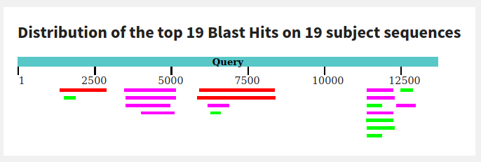

```{r setup, include=FALSE}
knitr::opts_chunk$set(echo = FALSE)
```

## Objetivos
- Comprender el funcionamiento de BLAST.
- Conocer los diferentes tipos de búsquedas posibles.
- Capacidad de utilizar la interfaz web de NCBI BLAST.

# BLAST, el algoritmo

## Contexto histórico
- Lipman & Pearson. 1985. Rapid and sensitive protein similarity searches. *Science* 227(4693):1435-1441.
  
> "One of the most rigorous programs for comparing
> amino acid sequences, SEQHP (5), requires more
> than 8 hours to compare a 200-residue protein to
> the 500,000-residue NBRF (National Biomedical
> Research Foundation) protein library on the VAX
> 11/750 computer."

- Altschul et al. 1990. Basic Local Alignment Search Tool. *J. Mol. Biol.* 215:403-410.

## Para qué sirve
- Comparar dos secuencias y encontrar similitudes locales (como Smith-Waterman).
- Buscar secuencias parecidas a una *query* en una base de datos (*target*).
- Múltiples aplicaciones:
  - Identificación de bacterias usando 16S rRNA.
  - Diseño de cebadores para amplificar un gen.
  - Anotación de regiones codificantes o proteínas.
  - Identificación de dominios en una proteína.
  - Recopilar secuencias homólogas para crear una filogenia.
  
## Para qué sirve
Partiendo de una secuencia nucleotídica o de proteína:

- ¿Con qué otras está relacionada?¿Cuál es su función? (Homología, dominios conservados).
- ¿Está ya presente en la base de datos? (Identificación).
- ¿Dónde se encuentra o cómo está organizada? (Anotación, ensamblaje).

## Qué meritos tiene
- Rapidez.
- Sensibilidad.
- Estadística.

## Cómo funciona
1. Detecta e ignora regiones repetitivas o de *baja complejidad* de la *query*.
2. Hace una lista de palabras de *k* letras de la *query* (*k* = 11 para DNA):

    ```
                          PQGEFG
                          PQG
                           QGE
                            GEF
                             EFG
    ```
3. Añade a la lista palabras *vecinas* que alinearan con puntuación de al menos *T*.

## Cómo funciona
4\. Busca las palabras de la lista entre las secuencias de la base de datos (indexadas).

5\. Alarga la *semilla* de los alineamientos encontrados (*High-scoring Segment Pair*, HSP).

   <div class="centered">
   
   </div>

## Cómo funciona
6\. Enumera HSPs con puntuación mayor de la que se produciría por azar.

7\. Evalúa la significación de los HSPs.

8\. Combina dos o más HSP en uno.

9\. Muestra el alineamiento local Smith-Waterman de cada resultado.

10\. Enumera los resultados con valor *E* menor o igual a un cierto umbral.

## Evaluación estadística de los resultados
La distribución de puntuaciones de HSPs entre dos secuencias de longitudes *m* y *n* está descrita por los parámetros *K* y $\lambda$. El número esperado de HSPs con una puntuación de al menos *S* (**valor E**) es:

$E = Kmne^{-\lambda S}$

En una búsqueda en una base de datos, *n* es la longitud total de la base de datos entera. Los parámetros *K* y $\lambda$ deben ser estimados mediante permutaciones. La probabilidad de observar al menos un HSP con una puntuación de al menos *S* por casualidad, es (distribución de Poisson):

$P = 1 -e^{-E}$

Este sería el valor *p*.

## Test
- El mismo HSP, en bases de datos de tamaños diferentes, ¿dónde tendrá un valor *E* mayor?
- ¿Qué es mejor, una base de datos grande o una pequeña?
- ¿Cómo afectará el tamaño de palabra, *k*, a la sensibilidad?¿Y al tiempo de ejecución?
- ¿Para qué sirve conocer la distribución teórica de puntuaciones de HSPs?

# Ejemplos

## [NCBI BLAST](https://blast.ncbi.nlm.nih.gov/Blast.cgi)

{width=700px}

## NCBI BLAST

{width=700px}

## Identificación de especies

Secuencias parciales de genes 16S rRNA de bacterias no cultivadas:

```{r rRNA, eval=FALSE, echo=TRUE}
AM179943.1
AM179942.1
AM179941.1
AM179940.1
AM179939.1
AM179938.1
AM179937.1
AM179936.1
AM179935.1
AM179934.1
AM179933.1
AM179932.1
AM179931.1
```

## Identificación de especies

{width=700px}

## Diseño de cebadores para el gen [MPO](https://www.ncbi.nlm.nih.gov/nuccore/NM_000250.2)

{width=700px}

## Diseño de cebadores para el gen MPO

{width=700px}

## Diseño de cebadores para el gen MPO

{width=700px}

## Filogenia mitocondrial de hominidos

 como outgroup](imatges/T06_Lemur_catta_mtDNA.png){width=700px}

## Filogenia mitocondrial de hominidos

{width=750px}

## Anotación de [un contig de DNA](https://www.ncbi.nlm.nih.gov/nuccore/MIZB01000007.1)

{width=750px}

## Anotación de un contig de DNA {.vcenter .flexbox}

{width=700px}

Los resultados del BLASTX sugieren que hay cuatro o cinco genes codificantes de proteínas en el contig.