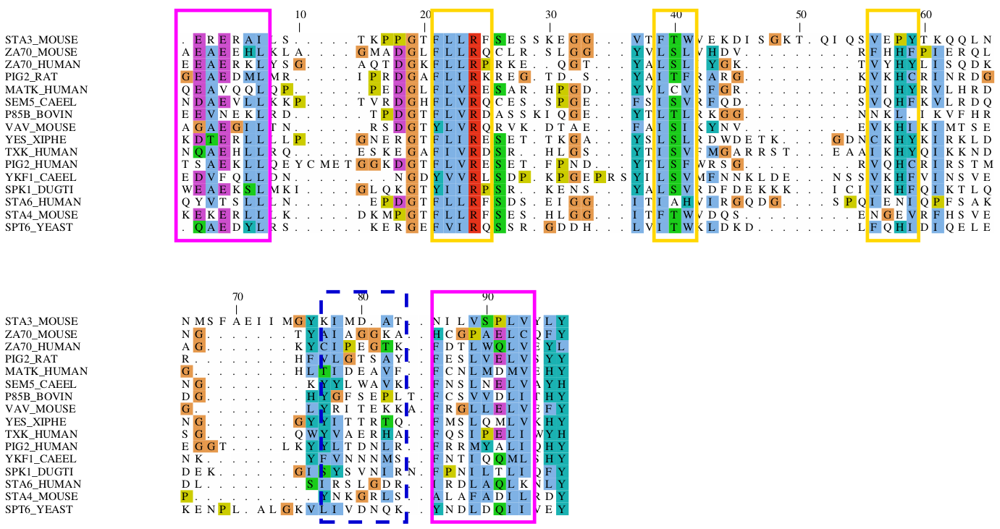
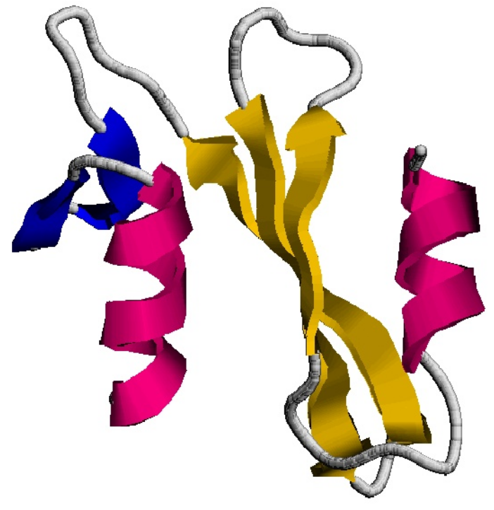
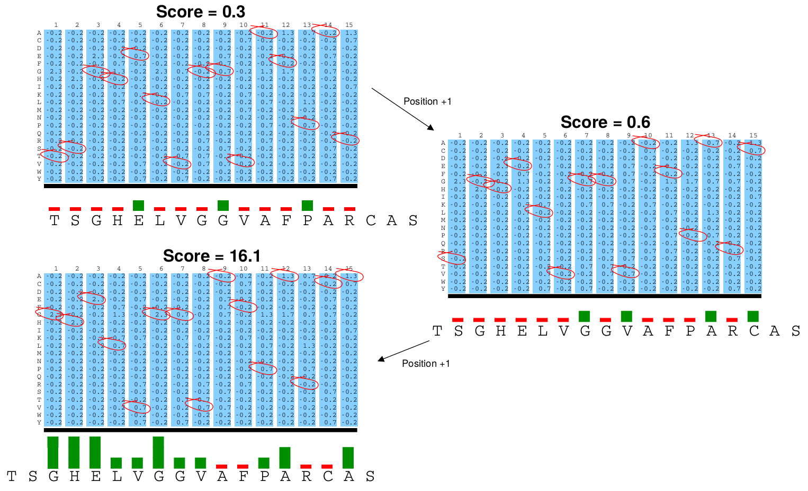
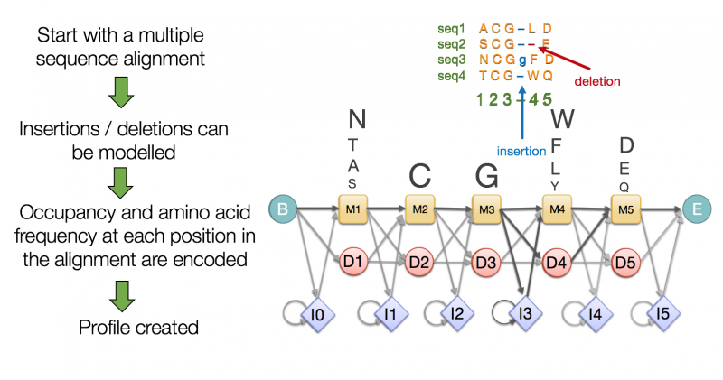

```{r setup, include=FALSE}
knitr::opts_chunk$set(echo = FALSE)
```

## Programas BLAST {.vcenter .flexbox}

](imatges/T07_blast_programs.png){width=700px}

## Estrategias de BLAST

Entre los diferentes programas BLAST (BLASTP, BLASTN, BLASTX, TBLASTN...), cuál usarías en cada uno de los casos siguientes?

1. Identificar la especie de origen de una secuencia.
2. Saber si una secuencia nucleotídica codifica algo.
3. Inferir la función de una secuencia proteica.
4. Construir la filogenia de una familia proteica.
5. Buscar genes codificantes de bacteriorodopsinas en una nuevo genoma recién secuenciado.

## Estrategias de BLAST

1. Identificar la especie de origen de una secuencia: BLASTN/MEGABLAST.
2. Saber si una secuencia nucleotídica codifica algo: BLASTX.
3. Inferir la función de una secuencia proteica: BLASTP/PSI-BLAST.
4. Construir la filogenia de una familia proteica: PSI-BLAST, TBLASTN.
5. Buscar genes codificantes de bacteriorodopsinas en un nuevo genoma recién secuenciado: TBLASTN.

# Búsquedas sensibles de proteínas

## Similitud y *distancia*
- El alineamiento local permite medir similitudes entre porciones de proteínes.
- Similitudes/diferencias se pueden entender como **distancias** en un espacio (como en un [análisis de correspondencias](https://en.wikipedia.org/wiki/Correspondence_analysis)).
- El BLASTP reconoce similitudes *cercanas*.
- El uso de una única *query* hace que la búsqueda no sea muy sensible: Una AI ¿reconocería cualquier queso a partir de un único ejemplo?

## La analogía del *clustering*
```{r}
library(ggplot2)
M <- data.frame(Familia=c(rep('A',55), rep('B',200), rep('C',200)),
                X = c(rnorm(55, mean=70, sd=7), rnorm(200, mean=60, sd=7),
                      rnorm(200, mean=30, sd=10)),
                Y = c(rnorm(55, mean=30, sd=7), rnorm(200, mean=75, sd=7),
                      rnorm(200, mean=60, sd=10)))
ggplot(data=M, mapping=aes(x=X, y=Y)) + geom_point()
```

## La analogía del *clustering*
```{r}
ggplot(data=M, mapping=aes(x=X, y=Y, color=Familia)) + geom_point()
```

## La limitación del BLAST
```{r}
seed <- sample(1:dim(M)[1], size=1)
while ((M[seed,'X'] < 38) || (M[seed,'X'] > 60)) {
  seed <- sample(1:dim(M)[1], size=1)
}
M$query <- NA
M[seed, 'query'] <- TRUE
seed.X <- M[seed, 'X']
seed.Y <- M[seed, 'Y']
ggplot(data=M, mapping=aes(x=X, y=Y, color=query)) +
   geom_point()  +
   geom_segment(aes(x = seed.X - 7, y = seed.Y - 7, xend = seed.X - 1, yend = seed.Y - 1),
                arrow = arrow(), color='black') +
   geom_text(aes(x = seed.X - 8, y = seed.Y - 7, label = 'Query', hjust = 1),
             color = 'black') +
   theme(legend.position = 'none')
```

## La limitación del BLAST
```{r}
M$Distancia <- sqrt((M$X - M[seed,'X'])^2 + (M$Y - M[seed,'Y'])^2)
M[M$Distancia > 25, 'Distancia'] <- NA
ggplot(data=M, mapping=aes(x=X, y=Y, color=Distancia)) + geom_point()
```

## La limitación del BLAST
- Una única *query* sesga los resultados: falta visión de conjunto.
- Falta sensibilidad para detectar homologías distantes.
- ¿Qué tienen en común las proteínas de una familia o con una función?
- Hace falta un **modelo** de lo que comparten unas u otras proteínas.

## Ejemplo: alineamiento y estructura
<div class="centered">
{width=700px}
</div>

## Ejemplo: alineamiento y estructura
<div class="centered">
{width=400px}
</div>

## Modelos de regiones conservadas
- Patrones y expresiones regulares.
- *Position Specific Scoring Matrices* (PSSM).
- *Hiden Markov Models* (HMM).
- PSI-BLAST.
- Delta BLAST.

# Patrones y expresiones regulares

## Secuencia consenso
```
     GHEGVGKVVKLGAGA   |
     GHEKKGYFEDRGPSA   |
     GHEGYGGRSRGGGYS   |----- alineamiento
     GHEFEGPKGCGALYI   |
     GHELRGTTFMPALEC   |
    -----------------
     GHEGVGKVVKLGAGA   |
        KK YFEDRAPSS   |      residuos
        FY GRSRG GYI   |----- observados
        LE PKGCP LEC   |      por columna
         R TTFM        |
    -----------------
     GHE**G*****G***   <----- secuencia consenso
```

## Secuencia consenso

- Ventajas
  - Rápido y fácil de implementar
- Limitaciones
  - Sin información sobre varianción en columnas.
  - Muy dependiente del alineamiento inicial.
  - Sin puntuación: resultado binario (sí/no).
- Utilidad
  - Patrones muy conservados, como lugares de restricción en DNA.
  
## Expresiones regulares
<div class="centered">
```
<A-x-[ST](2)-x(0,1)-{V}
```
</div>

- Alanina en N-terminal.
- Seguida de cualquier aminoácido.
- Seguido de serina o treonina dos veces.
- Seguidas (o no) por otro residuo cualquiera.
- Seguido por cualquier aminoácido excepto valina.

## [Expresiones regulares](https://www.genome.jp/tools/motif/MOTIF2.html)
- Señales post-traduccionales
  - *Protein splicing signature*: [DNEG]-x-[LIVFA]-[LIVMY]-[LVAST]-H-N-[STC]
  - Sitio de fosforilación por tirosina kinasa: [RK]-x(2)-[DE]-x(3)-Y or [RK]-x(3)-[DE]-x(2)-Y
- Señales de ineracción con DNA
  - Marca de histona H4: G-A-K-R-H
  - Marca de p53: M-C-N-S-S-C-[MV]-G-G-M-N-R-R
- Enzimas
  - Sitio activo de L-lactato deshidrogenasa: [LIVMA]-G-[EQ]-H-G-[DN]-[ST]
  - Marca de enzima activador de ubiqüitina: P-[LIVM]-C-T-[LIVM]-[KRH]-x-[FT]-P
  
## Expresiones regulares
- Ventajas
  - Rapidez de implementación.
  - Sencillez de diseño e interpretación.
- Desventajas
  - No modela bien las inserciones y deleciones.
  - Patrones cortos detectan muchos falsos positivos.
  - Poca capacidad de predicción.
  - Sin puntuación: solo resultados binarios.
- Utilidad
  - Detección de marcas pequeñas y sitios activos.
  - Comunicación escrita.

# *Position Specific Scoring Matrices* (PSSM)

## Frecuencias en cada posición {.smaller}
```
     GHEGVGKVVKLGAGA
     GHEKKGYFEDRGPSA
     GHEGYGGRSRGGGYS
     GHEFEGPKGCGALYI
     GHELRGTTFMPALEC
```

```{r}
library(kableExtra)
A <- c('GHEGVGKVVKLGAGA','GHEKKGYFEDRGPSA','GHEGYGGRSRGGGYS',
       'GHEFEGPKGCGALYI','GHELRGTTFMPALEC')
A.broken <- sapply(A, function(x) substring(x, seq(1, nchar(x)), seq(1,nchar(x))))
A.letters <- names(table(A.broken))
M <- matrix(0, ncol=nchar(A[1]), nrow=length(A.letters))
row.names(M) <- A.letters
for (i in 1:nchar(A[1])) {
  z <- table(A.broken[i,])
  M[names(z), i] <- z
}
as.data.frame(M) %>% kable() %>% kable_styling()
```

## Cambiamos 0 por un valor pequeño {.smaller}
```{r}
MM <- as.data.frame((M + 1) / 25)
as.data.frame((M + 1)/25) %>% kable() %>%
   kable_styling(full_width = TRUE,
                 bootstrap_options = 'striped')
```

## La puntuación
<div class="centered">
$S_{ij} = \log \frac{f'_{ij}}{q_i}$

La puntuación de un aminoácido *i* en cada posición *j* depende de cuanto más frecuente es ese aminoácido en esa posición del alineamiento ($f'_{ij}$) de lo que lo seria en una secuencia al azar $(q_i)$.
</div>

## PSSM {.smaller}
```{r}
kable(as.data.frame(round(log2(((M+1)/25)/(1/20)), 2))) %>% kable_styling(bootstrap_options='basic') 
```

## Funcionamiento de la PSSM
<div class="centered">
{width=700px}
</div>

## Balance de las PSSM
- Ventajas
  - Adecuadas para regiones cortas y conservadas.
  - Rapidez y facilidad de implementación.
  - Puntuaciones interpretables y valor E.
- Limitaciones
  - Inserciones y deleciones no permitidas.
  - Eso las hace inadecuadas para regiones largas.

# *Hiden Markov Models* (HMM)

## Ejemplo de HMM sencillo
<div class="centered">
{width=600px}
</div>

# PSI-BLAST

## Principios del PSI-BLAST
1. BLASTP estándard inicial, con BLOSUM62, e.g.
2. Construcción automática de una PSSM que permite indels.
3. La PSSM reemplaza la BLOSUM62 en un segundo BLASTP.
4. Se repiten los pasos 2 y 3 incorporando nuevas secuencias al PSSM cada vez.
5. Cuando ya no se encuentran nuevas secuencias, el PSI-BLAST ha *convergido*.

## Dos valores *E*
1. El umbral de valor *E* para el BLASTP inicial (opción *-e*, por defecto, 10).
2. El valor *E* de inclusión, para aceptar nuevas secuencias en PSSM (opción *-h*, por defecto 0.001).

## Ventajas del PSI-BLAST
- Rápido y eficiente.
- Mucho más sensible que el BLASTP.
- Uso sencillo.

## Peligros del PSI-BLAST
- Si sólo acepta secuencias muy parecidas, puede quedarse corto.
- Si acepta demasiada divergencia, puede incluir secuencias no homólogas (falsos positivos) e incluso no convergir.
- Requiere revisión manual: difícil de automatizar.

# Otros BLASTs

## Delta BLAST
- *Domain Enhanced Lookup Time Accelerated BLAST*
- Busca la proteína en una base de datos de PSSMs primero.
- Las PSSMs provienen de un subconjunto de la base de datos de dominios del NCBI (CDD).
- Utiliza la(s) PSSM(s) significativas en la búsqueda de más proteínas.
- Es más rápido que PSI-BLAST y se puede automatizar.
- No ayudaría mucho a identificar dominios nuevos. ¿Para qué puede servir?

## Delta BLAST. Ejemplos {.smaller}
<blockquote>
"To identify potential *Ostreococcus* transporter proteins,
mammalian sequences for all classes of SLC and all known
magnesium transporters were blasted onto the Ostreococcus
proteome using DELTA-BLAST (National Center for Biotechnology
Information), and gene models were then taken from the latest
version of the Ostreococcus genome using the Orcae
service (Ghent University)."
</blockquote>

[Feeney et al. 2016.](https://doi.org/10.1038/nature17407) Daily magnesium fluxes regulate cellular timekeeping and energy balance. *Nature* 532: 375-379.

<blockquote>
"ORFs were predicted [...]. To identify more distant homologues, ORFs were queried by DeltaBLAST against the Caudivirales subset of Genbank (NCBI taxonomy identifiers 28883 and 102294) with an e-value cutoff of 0.01."
</blockquote>

[Dutilh et al. 2014.](https://doi.org/10.1038/ncomms5498) A highly abundant bacteriophage discovered in the unknown sequences of human faecal metagenomes. *Nature Communications* 5: 4498.


